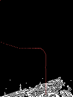
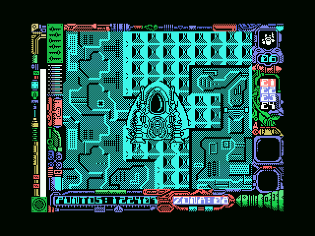
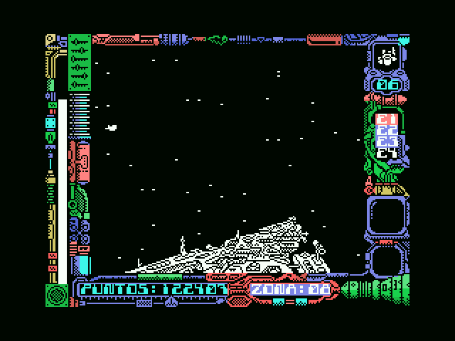
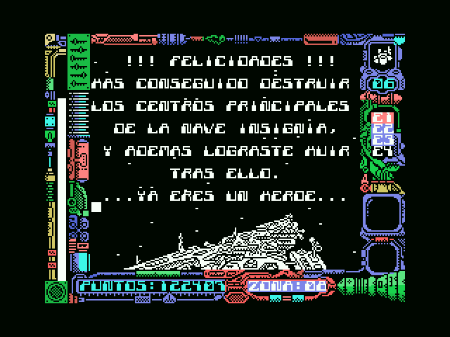
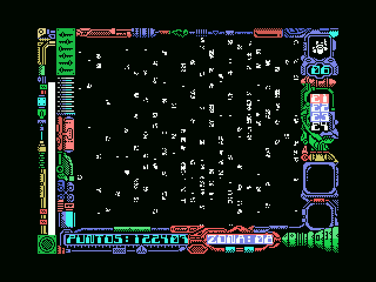
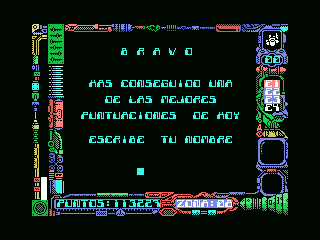

# Findings

Stardust is a ZX Spectrum conversion, and that much was known. What wasn't
expected on opening the tape is **how far the conversion goes**: they didn't
bring the graphics across and rebuild the rest, they brought the recording
system, the load routine and the way of drawing. What follows is what turned
up on taking it apart, each thing with the evidence that holds it up, arranged
by theme: the conversion, the loader, the two engines, the craft of drawing,
the world and its creatures, the sound, and the ending.

## Who actually made this version

The ZX Spectrum authors warn in their own repository that the MSX version was
done by other people. The game answers the question itself, in its credits
screen, at 0xF124:

```
CONVERSION POR
CARLOS ARIAS
GRAFICOS
JUAN CARLOS Y JAVIER AREVALO
...ADEMAS DE...
JULIO MARTIN
MUSICA COMPUESTA POR
GOMINOLAS
BASADO  EN
UNA IDEA  ORIGINAL
JOSE MANUEL  MU&OZ
TOPO SOFT
```

The conversion is **Carlos Arias**. The graphics stay with the Arévalo brothers,
the same as the original version, which fits with the artwork having been
carried over as it stood.

## A conversion down to the bone

The first thing that turned up: how much of this tape is not MSX at all,
but the Spectrum it came from.

### This isn't an MSX tape

MSX games are recorded in **KCS** blocks, the system's own format: the BIOS
writes them and the BIOS reads them.

Not Stardust. Its four data blocks are **ZX Spectrum blocks**, with the
structure from over there: a flag byte, the data, and a final byte that is the
XOR of everything before it. All four carry that checksum correctly, verified
one by one; it is the only integrity check the tape has.

And the loader is a **reimplementation of LD-BYTES**, the Spectrum ROM's load
routine, with the same register interface:

    ld ix,047a0h    ; IX = where it goes
    ld de,0b647h    ; DE = how many bytes
    ld a,000h       ; A  = the flag expected
    scf             ; carry set = load, don't verify
    call 0405ch

Anyone who has programmed a Spectrum will recognise that call: it is the one at
`0x0556` in its ROM, parameter for parameter.

### The 64K the Spectrum has and the MSX doesn't

Before loading anything, the loader does something an ordinary MSX game would
never need to: it **hunts for RAM and maps it into pages 1 and 2**.

    ld hl,04000h / call sub_d30fh
    ld hl,08000h / call sub_d30fh

The routine at `0xD30F` tries writing into each slot with `ENASLT` (the BIOS
call at `0x0024`) until it finds RAM. The reason is that the Spectrum has 48K of
flat RAM and the MSX doesn't: on the MSX the lower half of memory is taken by
the BASIC ROM. For the ported game to find memory where it expects it, the ROM
has to be got out of the way.

### The second load brings the Spectrum's LD-BYTES again

The tape chapter already told how the loader is a reimplementation of LD-BYTES,
the routine the ZX Spectrum ROM uses to read from tape. And also that the
routine with which the game loads its own second part is **not** a copy of that
one: its signature was searched for byte by byte across the three blocks and it
isn't there.

They are two different routines, but they come from the same place, and this one
carries it written in its constants. Three numbers, each in its place and in the
same order as in the original:

    0x16     the delay in LD-EDGE-1
    0x0415   the wait in LD-START
    0x9C and 0xC6   the thresholds with which LD-LEADER recognises the pilot
                    tone by measuring how long the pulse lasts

Even the split into two routines is the same: one calls the other and returns if
it fails, which is what LD-EDGE-2 does with LD-EDGE-1. The only thing genuinely
ported is reading the bit, because the Spectrum goes through `in a,(0feh)` and
here it has to go through the PSG's register 14.

And as a bonus, the show: on every edge read, the routine feeds the border
colour the masked refresh register (`ld a,r / and 00fh`), which is exactly **the
colour stripes the Spectrum makes while loading**, mounted on the only place
where an MSX has a border colour.

This is an identification by structure and by constants, **not a diff**: there
is no Spectrum ROM in this repository to compare against. With three such
specific numbers each landing in its place it is hard for it to be anything
else, but it is worth knowing what kind of proof this is.

### The explosions carry a Spectrum fossil inside

Both stages have a particle explosion, each with its own copy of the code. The
ship one —when the protagonist gets shot down— seeds **64 particles** at the
ship's position and moves them **with gravity**: the vertical speed grows one
notch per frame, and each particle is a single pixel drawn onto the buffer.
The happy-ending one —the flagship seen from outside— is **200 shrapnel
particles** biased upwards, with no gravity.

And in both, inside the loop that paints each particle, sits this:

```
c663: and 018h / out (0feh),a
```

**0xFE is the ZX Spectrum's border port.** On the original, every particle
made the screen border flicker; on the MSX that port does nothing, and the
instruction is still there, running for nothing on every particle since 1987.
Both copies of the effect drag it along: the cleanest proof this project has
produced that these routines came over from the original untouched.

In passing: the randomness of the particles —and of the ship stage's 48-star
background field, which is random heights drawn with the fixed pattern
`0x18`— comes from a generator that **reads the BIOS ROM as an entropy
table**. And the immortality POKE from the Input MSX magazine (the one that
patches 0xC06E) acts precisely on the dispatcher that decides whether the ship
is alive or exploding: immortality is, literally, never letting the particle
system get called.

### A slip in the enemy spawner, inherited instruction by instruction

The routine at 0xD41A works out the difficulty with `rrca`, which *rotates*
instead of shifting: since `7 − zone` is odd on exactly the even-numbered
zones, there the low bit lands in bit 7, the mask saturates to 0xFF, and the
odds of an enemy entering by that route drop to one in 256. The progression is
clean only on the odd ones: 1/8, 1/4, 1/2, and on zone 7 it enters without
rolling.

And it is not the conversion's doing. Checked against the disassembly
published by the ZX Spectrum authors themselves, the matching routine sits at
$D4CF with the same sequence — `LD A,$07 / SUB B / RRCA / ADD A,E` — 52 of its
68 bytes identical and not one opcode different: the 16 that change are
address operands. The `rrca` was there in 1987 and the port copied it
instruction by instruction.

And in play that is exactly what happens. Pointing the emulator at the
`add a,e` at 0xD436 —right after the `rrca`, with the zone alongside— over the
stretch of the recorded playthrough where the ship game owns the memory, the
206 times it executes give this table and no other:

```
zone 2   A=0x82      zone 3   A=0x02
zone 4   A=0x81      zone 5   A=0x01
zone 6   A=0x80      zone 7   A=0x00
```

The three even zones that got played all carry bit 7 set, so the mask really
does saturate; the odd ones give the clean progression. And zone 7 comes out
0x00, which is the case where the enemy enters without rolling at all. It is
softened, mind, by those tables having another spawn route, through the map
tiles, that ignores the zone.

What cannot be claimed is the intent. That a shift was meant is what
everything suggests — the game uses `srl` to divide in both blocks, and `rra`
is a single bit away from `rrca` — but nobody can read the mind of whoever
wrote it, and the authors themselves left that routine uncommented.

## The loader, and what it carries

The loader is good for several findings on its own, and the game hides a
second one inside.

### The loader ships with a back door for trainers

This is the best one. Before starting the game, the loader copies **94 bytes**
from 0xDAC0 to 0xFDE8 —high memory, where nothing is going to overwrite them—
and then looks at what is in them:

    4040: ld hl,0fde8h / ld b,003h
    4045: ld a,(hl) / cp 0c9h / jp nz,0bd85h   ; three 0xC9 as a signature?
    404e: ld b,(hl)                            ; B = how many patches
    4050: ld e,(hl) / ld d,(hl) / ld a,(hl)    ; address and value
    4056: ld (de),a / djnz 4050                ; apply them
    4059: jp 0bd85h                            ; and now, off to the game

If those 94 bytes begin with three `0xC9`, the loader treats them as a list of
patches and applies them to the freshly loaded game. It is **a factory-fitted
POKE applier**, inside the game's commercial loader.

And the arithmetic says how many it was built for: 3 bytes of signature + 1
counter + **30 patches of 3 bytes each = 94**. Sized for exactly thirty.

That explains why the magazine loaders of the period worked so well with this
game. The one in *Input MSX* number 19 writes with `FOR I=56000 TO 56012`, and
56000 is 0xDAC0: the mailbox. Its three patches, read out of the binary before
applying them:

    0xC06E/6F:  38 1F (jr c,+31)  ->  18 EC (jr -20)
    0xF7B1:     01 -> 00

The second changes the `1` of an `ld a,001h` into a `0`. Applied by the game's
own loader, the ship survived sixteen minutes straight.

#### And the first one jumps into a routine the game ships and never calls

This page used to say that patch "turns a conditional jump into an
unconditional one, skipping a check". That was false, and the line right above
it said so: the new displacement is `EC`, that is **−20**. The jump doesn't go
forward skipping anything, it goes **backwards**, to 0xC070 − 20 = **0xC05C**.

And at 0xC05C there were, until now, seven bytes declared "filler or
remainder". They are not:

    c05c:  ld a,003h        ; the shield
    c05e:  ld (0c188h),a    ; back to three
    c061:  jr  0c08fh       ; and on with the ship, as if nothing happened

So immortality isn't about dodging the explosion: it is that **the shield is
refilled to three on every single frame**, faster than the game can spend it.

The striking part is whose routine that is. **It is on the tape, and in the game
as sold nobody calls it**: its address does not appear even once among the
46,663 bytes of the block, and no relative jump lands on it. Seven bytes doing
exactly what you would need in order not to die, sitting exactly twenty bytes
away from the jump you have to patch.

That the authors left it there as a test switch is what it looks like, but that
is a guess and it is stated as one. What is measured is the behaviour, and twice
over: in the PC sampling of the long session —played **with** the trainer on—
those three instructions show up 28, 13 and 33 times and the explosion's particle
seeder **not once**; in the sampling of a session played by hand **without** the
trainer, 0xC05C never appears and the explosion does.

### How the game asks for the second part

On clearing the last ship zone a screen comes up reading

    FELICIDADES
    HAS CONSEGUIDO PENETRAR LAS DEFENSAS DE LA NAVE INSIGNIA
    PERO LO PEOR AUN NO HA LLEGADO

and the game goes back to the cassette for the second part, the one on foot.

The interesting bit is **how**. The loader's load routine survives in page 1 for
the whole game —the game loads from 0x47A0 up and doesn't tread on it— so the
obvious thing would be for it to call that. It doesn't. The game brings its own,
and that routine is **a second port of the Spectrum's LD-BYTES**, the same one
the tape loader already reimplemented:

    f7f6: ld hl,0f89fh / push hl    ; the return address, pushed by hand
    f7fb: ld a,008h / out (0abh),a  ; switches on the tape MOTOR
    f7ff: ld a,00eh / out (0a0h),a  ; PSG register 14, the tape-bit one
    f804: inc d / ex af,af' / dec d / di      ; LD-BYTES, opcode for opcode
    f808: ld a,005h  ...  ld hl,00415h        ; and its very constant, 0x0415
    f848: ld (ix+000h),l            ; each byte read, stored through IX
    f887: in a,(0a2h) / cpl / xor c ; reads the tape bit back off the PSG
    f893: ld a,r / and 00fh / out (099h),a    ; and flickers the border, via the
                                              ; VDP where the Spectrum used a port

Nor is it a copy of the loader's: its signature was searched for byte by byte
across the three blocks and appears in none of them.

**How it was settled.** Starting from a savestate taken on the FELICIDADES
screen and sampling the program counter every two milliseconds throughout the
load: **84,441 samples, every single one inside 0xF7F6–0xF89E. Not one in ROM,
not one in page 1.** Meanwhile IX —the pointer that `ld (ix+000h),l` stores
through— walks from 0x61D0 to 0xD674, which is exactly the last byte of a
29,861-byte block. The BIOS takes no part in this, and neither does the loader.

What is left in memory afterwards matches the tape's block to **99.78%**: 66
bytes out of 29,861, in thirty short runs, and they are the variables the second
part had already written by the time the dump was taken —among them the three
46-byte sound-channel states at 0xD068, 0xD096 and 0xD0C4.

This used to be written down here as an open contradiction, because a
breakpoint on 0xF7F6 never fired while replaying a recorded playthrough. The
explanation turned out to be mundane: that recording *begins* at the instant the
loader is already running —its first frame has the program counter at 0xF849,
inside the routine— so a breakpoint on the entry point has nothing left to
catch. The 0xF89F sitting on the stack could only have been put there by the
`push hl` at 0xF7F9.

### Why the second part loads exactly at 0x61D0

The load address of the on-foot stage's block looked arbitrary until the font
turned up. That stage's two text printers —the one for the DEMO sign and the
menu, which paints double-height through the checkerboard, and the frame one,
which writes straight to video memory— use the same ASCII font, indexed as
`0x5F00 + code×8`. The font is left in place by the ship block, and the
on-foot stage reuses it.

The arithmetic closes on its own: the last character the font needs is `Y`
(code 89), and 0x5F00 + 90×8 = **0x61D0 exactly**. The second part's block
loads at the first free byte after the `Y` glyph: not one byte earlier, so as
not to eat the inherited font.

## Two engines, one shared library

The two halves of the game don't share an engine — they share the tools.

### Two different engines on one tape

The two halves of the game don't share an engine, and it shows in how they
carry their creatures. In the ship part each entity points to its governing
routine inside its 8-byte structure, and the game jumps there with a `jp (hl)`:
capturing those jumps with the game running, the IX values go up in 8s (0xCB3A,
0xCB42 · 0xC8D8, 0xC8E0…).

And that `jp (hl)` is really **a call, not a jump**, because the Z80 has no
`call (hl)`. What the game does is push the return address by hand:

    ld hl,0cb9dh        <- the return address
    push hl             <- onto the stack, as a CALL would
    ld l,(ix+003h)
    ld h,(ix+004h)
    jp (hl)             <- and off to the object's behaviour

Whatever `ret` ends that behaviour will land on 0xCB9D, the next instruction.
It is an indirect `call` built out of two instructions.

And there is a finer touch still: when an object has nothing to do, instead of
storing a null pointer and testing for it, the game installs **the address of a
`ret` that already exists in the code** (0xD959). That way the loop never has
to ask: it always calls, and the one with nothing to do returns immediately.

The foot part doesn't treat its enemies that way: they live in tables of
**5 bytes per object** —the walkers at 0xACE4, four at most; the flyers at 0xACF9; the
turret's two shots at 0xAD04— and carry no routine pointer: fixed loops move
them, one per species.

This page used to say "the IX values go up in 46s: entities almost six times
bigger", from mistaking what its `jp (hl)` at 0xC544 dispatches for the enemies.
The measurement was good, the reading wasn't. And now we also know what they
really are: **the sound interpreter's three channels**.

The code says so, in the simplest way: the routine that starts a sound takes a
channel number, **multiplies it by 46** and adds a base to reach that channel's
state. Both halves of the game carry that routine, identical but for the base:

    ships    and 07fh / ld de,0002eh / call ... / ld de,0ed75h
    on foot  and 07fh / ld de,0002eh / call ... / ld de,0d068h

And 0xD068 is exactly where the mystery IX values landed. The arithmetic closes
on both sides: three 46-byte channels from 0xED75 end at 0xEDFF, precisely the
address the code loads for the interpreter's variables.

So that `jp (hl)` wasn't dispatching entities: it was dispatching **music
commands**. It is the same interpreter in both halves, with its three channels.

What they do share is the craft of drawing. It is the Spectrum technique, from a
machine with no hardware sprites: the image is shifted bit by bit with an
unrolled run of `adc hl,hl`, a hole is opened with AND, and it is painted with
OR.

(This page used to say that "comparing 40 bytes of the sprite routine of one
part against the other, only six differ, and three of those are `and (hl)`
against `or (hl)`". The measurement was right and the pairing was not: it was
comparing the **pattern** run of one half against the **mask** run of the other,
which are not twins but the two halves of the same routine. Paired properly the
result is **26 bytes identical out of 28**, and the only difference is one
jump's operand.)

#### And it isn't just the sprites: they share a whole library

That last paragraph fell short. Looking at the rest of the service routines, it
turns out **they don't merely resemble each other: they are the same routines,
copied and relocated**. Five are identical byte for byte:

    buffer_dir      0xC541 / 0xAACD   18 of 18 bytes
    solapa_eje      0xCD7A / 0xAEC2   12 of 12
    hay_tecla       0xF660 / 0xD30B   16 of 16
    mul_a_de        0xE591 / 0xC8A6   21 of 21
    vram_pon_dir    0xEE24 / 0xD117   16 of 16

And in the rest, what turns resemblance into proof is **where** the differences
fall: in pairs of consecutive bytes, which is exactly what a 16-bit operand
measures. The sprite painter is 198 bytes long and 21 of them differ: twenty are
ten addresses —the sprite pool, the row counter, the two `jr` instructions the
routine patches in itself, the call to `buffer_dir`, the two jumps with which
the shortcuts step over the runs, and the one that closes the row loop— and the
twenty-first is **a single loose byte**, the bottom clipping limit, `0x50` in
the ship stage and `0x4F` in the on-foot one. Out of the whole routine, that is
the only thing that really changes. The glyph painter, 144 bytes, gives the same
shape: 13 differences, six addresses and that same byte again.

(This was published as "eleven of its 74 bytes differ". Those 74 were the
**first** 74: the routine is 198. Measured whole, the conclusion doesn't just
survive, it gets stronger, because the ten extra bytes are five more addresses.
But the figure was wrong, and it spoke of "the whole routine" having looked at a
third of it.)

In `borra_buffer` the four differences are that the `di` sits before the
`ld hl,0 / add hl,sp` in one part and after it in the other. In the random
generator, the four are the address of the seed, which appears twice.

Counted in bulk: searching for identical runs of 32 bytes or more between the
two blocks yields 58 runs and 5867 bytes, of which 1200 fall in code. That
figure is deliberately low, because **every differing address splits a run in
two**.

There are also differences that aren't relocation but decision. `gira_rumbo`
exists in both and does the same thing —bring the current heading one eighth
closer to the requested one, the short way round— but the on-foot one is missing
the part that consults a wait counter held in bits 3 and 4 before applying the
turn. That is why **the ship takes a few frames to tilt from one inclination to
the next and the man on foot changes direction instantly**.

With that, the sentence above can be sharpened: the two game engines are
different, the service library is the same.

#### How to place a drawing between two bytes: four ladders

Video memory is organised in bytes, eight pixels at a time. To put a ship at
column 173 the drawing has to be **shifted inside the byte**, and on a Z80 that
costs. The game's answer is the period's answer: a run of shift instructions
written one after another, entered at exactly the right height. The painter
takes the low three bits of X and **writes its own jump**:

    c494:  ld a,l / and 007h / jr z,...              the column falls flush
    c499:  dec a / ld c,a / add a,a / add a,c / add a,007h    (n−1)·3 + 7
    c49f:  ld (0c4c4h),a / ld (0c4fbh),a             patches its two `jr`s

The 3 is the size of one rung (`adc hl,hl` is two bytes and `adc a,a` one) and
the 7 is the size of the shortcut sitting in front of it. That way the jump lands
on the right rung and exactly the needed steps remain.

**And the steps run the opposite way to what you would expect.** To move the
drawing n pixels *right*, it takes 8−n steps *left* across a three-byte window:
what falls off the top is precisely what has to show up in the neighbouring byte.
With n=0 all eight would be needed, and those eight come free by shuffling
registers around — that is the shortcut.

Looked at closely, the run doesn't shift: it **rotates**. A, H and L turn as a
single 24-bit number, and it works as a shift because what wraps around is the
padding. And the padding is the only thing that tells the two runs of each
painter apart:

    mask     enters with A=0xFF and `scf`   → pads with ONES  (background shows)
    pattern  enters with `xor a`            → pads with ZEROS (paints nothing extra)

That is why it is the same code twice rather than one routine called twice: each
lands somewhere different —the one that stamps with AND and the one that stamps
with OR— and this is the inside of a sixteen-row loop, where a call and its
return would be paid thirty-two times per sprite.

There are four ladders, two per painter —the sprite one works 24 bits wide, the
lettering one 16—, and all four exist in both halves of the game, identical byte
for byte except for one jump's destination:

    mask    24 bits   0xC4C5 / 0xAA51   26 of 28 bytes
    pattern 24 bits   0xC4FC / 0xAA88   26 of 28
    mask    16 bits   0xC590 / 0xAB1C   18 of 20
    pattern 16 bits   0xC5B5 / 0xAB41   18 of 20

#### Six bytes that were counted as filler

In the lettering painter the patch arithmetic is `n·2 + 4` instead of
`(n−1)·3 + 7`, because its rungs are two bytes and its shortcut six (it is the
same formula written differently: `n·2 + 4` is `(n−1)·2 + 6`). Written that way
it says where the run begins: with n=1 the jump goes to 0xC5B5 + 6 = **0xC5BB**.

At 0xC5BB there was no run: there was a range declared "filler or remainder".
The run was recorded as starting at 0xC5C1 —its fourth rung— and the six bytes
in front of it, `ed 6a` three times, were orphaned. With them, the ladder has the
same seven rungs as the other three.

The interesting part is **why it had gone unseen**, because the measurement was
not at fault: the program-counter dump had those three rungs at 40, 155 and 226
samples, more than plenty of addresses that had been declared. The data was
there. What was missing was **anybody crossing the measurements against the
ranges declared as data**: the guard that exists crosses data zones against the
*trace*, and the tracer didn't reach there either.

Doing that cross-check by hand turned up two more ranges, and both were code:
the seven bytes where the magazine's POKE lands —told above— and eight more at
0xE03D which turned out to be an object behaviour, installed as a pointer from
two places in the block itself. Fifteen bytes sitting in the wrong column.

## The craft of drawing on an MSX

What had to be invented to draw a Spectrum game on a machine that keeps
its screen behind a port.

### What the MSX forced them to change

There is a difference of substance between the two machines that the conversion
could not dodge. The Spectrum writes **directly** into its screen memory, which
is ordinary RAM at 0x4000. On the MSX, video memory sits behind the graphics
chip and cannot be addressed: it has to be sent byte by byte through a port.

So this version carries something the original doesn't need: a **screen buffer**
in RAM, and a routine that dumps it. The buffer runs from **0x4000 to 0x4EFF:
3,840 bytes, 24 wide by 160 tall**, and the dump moves it to VRAM in **three
bands** —0x4000 with 56 rows, 0x4540 with 64 and 0x4B40 with 40—, one per call
of the routine, each into its own third of SCREEN 2. The code says so (the
three calls at 0xF3DC, contiguous and closing to the byte) and the emulator
confirms it, where that routine made **3,252,480 writes** with the pointer
walking exactly 0x4000-0x4EFF.

**The axes went out backwards**, and it is worth telling because the error
spread. The dump's `ld b,028h` was read as "40 columns", but it is the inner
loop and it walks the buffer in steps of 24: it collects 40 bytes from a single
column. The one counting columns is the outer loop, `ld c,018h`, stepping one
byte at a time, 24 times.

Drawing it catches it: 24 at a time gives a legible high-score table; 40 at a
time, noise. And it fits what you see while playing, which is where the doubt
came from: 24 bytes are 192 pixels, narrower than the screen —which is why the
frame down the sides never moves— and the surplus is vertical, which is the way
it scrolls.

### One plane only, and why it looks like two

Anyone who played it remembers two floors moving at different speeds, with that
sense of depth. It got looked into properly: watching which routine writes into
each band of the buffer, and building, frame by frame, the table of "which row
was drawn from which address", which lets the displacement be measured by exact
integer equality instead of by comparing images.

The verdict is emphatic: **the background is a single plane**. Across four
measurements —three moments of the on-foot stage and one of the ship stage—
the buffer's eighteen strips (three bands by six columns) move **identically**:
+2 rows per frame walking, 0 standing still, −2 backwards, at 100 % exact
match and with no horizontal displacement at all.

The depth lives somewhere else: in the **drawing order**. Numbering every
write into the buffer within a frame, the ship stage always produces the same
sequence: first the whole background, then the sprites, and **after the
sprites** one more routine (0xC77A) that paints scenery columns from its own
tile store. It was caught doing it live: a pillar coming down, the ship
climbing towards it, and when their destinations crossed, the pillar got
painted on top. The ship doesn't fly *under the floor*: it flies **behind
whatever gets repainted afterwards**.

And in the on-foot stage the parallax **really exists** — it just isn't a
plane: it is a picture that gets redrawn differently. The background is
painted **twice per frame by patching an opcode**: the game loop writes `0xC2`
(`jp nz`) into 0xA98E and calls the redraw —so only the empty cells get
painted, and they carry tile 0— then writes `0xCA` (`jp z`) and calls it
again, for the solid ones. And that tile 0 is alive: every scroll step
**rotates it by one pixel row** (0xB140 going up, 0xB167 going down; the row
that leaves comes back in on the other side). One row of pattern for every two
of scroll: **the background inside the gaps moves at half the speed of the
platforms**. That is why the buffer strips all move identically —the paragraph
above still holds— and the eye still sees two speeds. Measured over the whole
recorded game: 4712 passes with each opcode, not one frame with any other
value.

#### And there is a third opcode, which is an impossible jump

This page used to say there were two opcodes. There are **three**, and the
missing one is the cleverest of them. The instruction right before the patched
jump is an `and a`, which **clears the carry by definition**:

    a98a: and a                <- carry is 0, always
    a98b: ld b,(iy+004h)
    a98e: jp ?,L_A9E4          <- the opcode that gets patched

So the third value, `0xDA` (`jp c`), **never jumps**. It isn't a third
condition: it is the way to have no condition at all. With `0xC2` only the
empty cells get painted, with `0xCA` only the solid ones, and with `0xDA`
**all of them, in a single pass**.

One routine writes it, and reaching that routine takes three things at once:
the scroll at the very top (row 0x47), **all six targets destroyed**, and the
player positioned between 0x50 and 0x5F. That is, the end of the stage.

And that explains why the 4712-pass measurement never saw that value,
without either statement ceasing to be true: **that measurement's window
stopped short of the stage's ending**, so those three conditions were never
met inside it. The third opcode's only use in the whole game is the closing
travelling shot, and it has been watched executing: it is told in
[How the game ends](#how-the-game-ends-and-a-pointer-table-that-was-coordinates).
The measurement was sound; what fell short was concluding that only two values
were possible.

### The same lettering, sharp or see-through

On the high-score table the text comes out with its pixels separated, as though
half transparent, while the `DEMO` label is perfectly sharp. They look like two
typefaces. It is the same routine, and the difference is made by **patching the
code on the fly**.

The routine that draws a character draws it at double height: each line of the
font is painted twice, and each copy is masked with a different pattern.

```
d4d0: ld a,(de) / and 055h / or (hl) / ld (hl),a / add hl,bc
      ld a,(de) / and 0aah / or (hl) / ld (hl),a / add hl,bc
```

`0x55` and `0xAA` are `01010101` and `10101010`: alternating pixels, offset from
one line to the next. The result is a checkerboard, which reads as a half tone.

And here is the trick: those two masks **are not constants**. They are the
operands of those two `and` instructions, at 0xD4D3 and 0xD4D9, and the game
rewrites them before drawing:

```
bfb4: ld a,0ffh / ld (0d4d3h),a / ld (0d4d9h),a   ; neutral mask
bfbc: ld ix,0ddf2h                                ; the "DEMO" string
bfc0: ld hl,04d94h / call 0d4e5h                  ; draw
bfc6: ld a,055h / ld (0d4d3h),a
bfcb: ld a,0aah / ld (0d4d9h),a                   ; and put them back
```

With `0xFF` the `and` removes nothing and every pixel comes through. It is
self-modifying code used as if it were a parameter.

Along the way the routine confirms where the font lives: it indexes with
`0x5F00 + code×8`, and with the first code being 0x20 that lands on 0x6000,
exactly where the 59 characters are. And the stride between screen lines is 24,
the height of the column-major buffer.

### Two `call 0000h` that don't exist, and 192 bytes that were not text

The very first thing the game does is the STARDUST logo bouncing. And that
animation hides the reason a cold disassembler cannot handle this area.

Assembling one frame takes two operations: **painting** the logo stretched to
whatever height is due, and **clearing** the rows the previous frame left dirty.
Which of the two goes first depends on whether the logo is rising or falling.
Instead of solving that with an `if`, the routine **writes its own two `call`s**:

    f000:  ld (0f016h),hl        the operand of the first call
    f003:  ld (0f019h),de        and of the second
    ...
    f015:  call 0000h            filled in from HL
    f018:  call 0000h            filled in from DE

On tape those operands are `00 00`, so a cold listing shows two `call 0000h` —
and a helpful disassembler hangs a BIOS routine's name off them, which means
nothing here. In flight they are always the same two addresses, in whichever
order an `ex de,hl` decides.

Worth looking twice before calling something orphaned: those two routines were
recorded as "nobody calls them", and it is true no `call` names them, but their
addresses **are** written in the binary, exactly once each, as the operands of a
`ld`.

Pulling that thread turned up an error in what was published. **The credits text
is not 429 bytes, it is 234.** The declared range began 192 bytes too early and
swallowed **the logo's frame table**: 96 pairs (top row, height) describing the
bounce —the height grows from 1 to 16, the logo falls to row 186 flattening out,
and comes back— with an `0xFF` closing the list. Where the text really starts is
stated by the code itself, and the binary agrees: before `CONVERSION POR` there
are increasing pairs that are not text and don't look like it.

### The credits scroll without moving the picture

The game's credits —the five cards naming the people who made the MSX
version— are shown one at a time in the middle band of the screen, with a
pause to read them, and each one bows out by **sliding upwards**.

Moving that band looks expensive: it is 2,048 bytes of drawings. The routine
doesn't touch them. Remember the MSX keeps two tables, one saying which
drawing each cell carries and one holding the drawings, and it **moves the
first**: 256 bytes instead of 2,048. Since every cell points at its drawing,
shifting the indices shifts the picture. It comes out eight times cheaper.

Each tug moves 32 positions, exactly one row of the screen, and it gives eight
tugs: the band's eight rows. When it finishes it clears the drawings and
**rebuilds the cell table**, and there the nice confirmation shows up: it
rebuilds it with the same interleave in eights the loading screen left behind
—0, 8, 16… 248, then 1, 9, 17…— in six instructions. The game knows exactly
how that table arrives and takes care to put it back.

Until now that interleave had only been read in the loading screen's code.
Here it turns up a second time, written by another hand and in another block,
and it explains along the way why the scoreboard can write drawings and always
land on the right cell.

### The scoreboard doesn't write letters: it redraws the cells

The whole scoreboard of the ship stage —score, lives, zone number— comes out
of a single routine at 0xF41D, and the first surprising thing about it is that
it **doesn't write characters**. MSX video memory holds one table saying which
drawing each screen cell carries, and another holding the drawings. The normal
way to print a "7" would be to put the number of the seven's drawing into the
right cell. This routine does the opposite: it leaves the cells alone and
**changes the drawing underneath**.

It can afford to because the table is already set. The cell table was left
there by the loading screen and the game inherits it untouched, so every slot
of the scoreboard already points at a drawing nobody else uses. Printing
becomes dumping the letter's eight bytes on top.

The detail that seals it is the step between glyphs: **0x40 bytes**, which is
eight drawings. It looks like an odd stride until you remember the cell table
arrives **interleaved in eights** from the loading screen. With that
interleave, skipping eight drawings lands exactly on the next cell along. The
two oddities cancel out.

Four places in the code call it, and each one is an indicator:

- The **score** is six digits kept as text at 0xDD80. One routine sets it to
  "000000" at the start, and another adds to it by **doing decimal arithmetic
  by hand on the ASCII**: bump the digit, and if it goes past "9" send it back
  to "0" and carry one to the left. There is never a binary number to convert,
  because the scoreboard *is* the number.
- **Lives** and **zone** are one digit each (0xE156 and 0xE157), printed by
  adding 0x30 to turn them into ASCII.

And there's a coincidence that says a lot: the score is painted at the same
video address, 0x12B0, in both stages of the game. The ship half and the
on-foot half don't share a single line of code, yet they put the scoreboard in
the same place on screen.

#### Both stages die the same way

Once you read the ship stage's lives, three things turn out identical to the
on-foot stage, and none of them is chance:

- **They are initialised twice, and the second one wins**: the menu leaves a
  three and the start of play overwrites it with a two. Exactly the same pair
  as on foot, down to the order.
- **The extra life on points caps at nine** in both.
- And the subtraction only fires when a counter reaches **45**, the same
  number that closes the on-foot dying sequence. The address changes —0xC188
  here, 0xA6ED there— but the mechanism is the same: a byte that means little
  while you live and starts counting the moment you're killed.

And that "means little while you live" is more specific than it looked: **it is
the shield**. From 0 to 3 it counts the hits the ship can take, and there are
two kinds of hit, one that spends a point and one that spends two —the second
checks twice, between subtractions, whether the first was already enough to
kill you—. Of the six writes that variable gets, **only one puts the four** that
sets off the explosion, and ten places in the listing lead to it: death has a
single door.

That rounds off the 10,000-point award, too. Before granting the life, the game
looks at the shield: if you arrive with less than 2, instead of a life **it
tops the shield back up to 3**. So the same award is one thing or the other
depending on how you get there — with the ship damaged it heals you, with the
ship intact it gives you a life.

Which is where a piece that had been lying loose since day one finally fits.
The immortality POKE published by *Input MSX* magazine issue 19 patches a jump
to skip the comparison of that counter against four. It is **the same
invulnerability gate** the on-foot stage has in triplicate: with the counter
already at four or more, the game ignores collisions because it thinks you are
in the middle of dying. The POKE doesn't hand out lives: it parks the player
in that state permanently.

### The game frame travels in the block, and the loading screen sets the table

The decorated border surrounding the play area —HUD included: the rosette
with the ship, the coloured gauges, the PUNTOS and ZONA bar— is not drawn
piece by piece: **it ships pre-drawn inside the game block**. Its first 1415
bytes are the STARDUST logo (a 128×16 bitmap the attract mode animates in the
central area) and, behind it, the frame's patterns and colours, 0x900 bytes
of each, which a startup routine copies to video memory.

The copy has an odd shape —two character rows per screen third and
forty-eight loose strips— that only makes sense with the other half of the
trick: the game **never builds the SCREEN 2 name table**. **It inherits it
from the loading screen**, which had filled it "adding eight": character n of
each third shows up at column n÷8, row n mod 8. Loading the tape tramples the
loading screen's program in RAM, but video memory survives, and the game
counts on that. Under that inherited mapping the odd layout is, simply, **the
shape of the frame**: characters 0 to 31 and 224 to 255 of each third are the
four columns on either side, and the strips are the top row and the bottom
bar.

Both halves are checked against the emulator: the running game's actual name
table matches the inherited pattern **768 out of 768**, and the tape's
patterns and colours appear identical at **97.4%** —the rest being what the
game paints on top: the starfield, the live counters—. And the proof that
outweighs them all is drawing it from the tape with that mapping:


### The loading screen


Not a screenshot: it is drawn from the 12,288 bytes the block itself dumps
—6144 of pattern to video memory 0x0000 and 6144 of colour to 0x2000— following
what its routine at 0x9C10 does.

There is a catch to it, and an instructive one. The table saying which tile goes
in each cell is not filled in the order 0, 1, 2, 3… but **by adding eight**: 0,
8, 16 … 248, 1, 9, 17 … The same 256 values per screen third, but interleaved.
Drawing it assuming sequential order gives convincing noise, which is the worst
kind of error: it looks as though the block's layout is wrong when what is wrong
is how you're reading it.

It is signed **CANO**, bottom left.

## The world and its creatures

How the game carries its maps, its enemies, its collisions and its deaths.

### The map cell is the drawing and the state at once

The things bolted into the scenery —each zone's turrets and nests— are not
flying enemies: they are **eight-byte objects** the level builder creates on
entering the zone, one per occupied cell of a 5×5 grid. Each carries its
position, its type, **a pointer to its own cell** in that grid, and the address
of the routine that governs it.

And here is the nice part: **the installation does not store its frame**. It
writes it into the cell it points at, and whoever paints the zone draws whatever
the cell says. That is why a turret's reload cycle reads, in the listing, as a
count from 6 to 10 over a byte of the map: 6 is the loaded gun, 7, 8 and 9 the
animation, and on reaching 10 it goes back to 6. The same idea already found in
the on-foot stage, where the cell byte is the tile index and the physics solid at
the same time.

States chain by **rewriting their own routine pointer**: the turret fires and
becomes "turret reloading"; the nest releases an enemy aimed at the ship and
marks itself; whatever is blowing up walks its cell up to 0x10 and then retires
by installing, as its behaviour, the address of a `ret` that already exists in
the code — so the loop can keep calling everyone without asking.

The level builder decides what each cell is from its value, with a dice roll in
the middle: `call azar / and 004h / add a,006h` turns the value 6 into 6 or 10,
so **the same cell of the same level is sometimes a turret and sometimes a
nest**.

That is also where the four-way shot comes from. It is dropped by **the bonus
left behind when one particular type of installation is destroyed**, and only if
you already carry 10 of energy and the one-in-four roll lands; otherwise what you
get is ten more energy.

#### Seven tables in a row, and not one boundary has to be guessed

That RAM map can be read whole without guessing anything, because each table
carries its counter in front and **dies exactly where the next table's counter
begins**. The cap and the entry size aren't estimated: they come from the
insertion routine itself, from the `cp` that checks the cap and from how it
indexes.

    0xC8D7  counter    0xC8D8  9 installations of 8 B  →  0xC920
    0xC920  the zone's 5×5 grid, 25 B                  →  0xC939
    0xC939  counter    0xC93A  6 enemy shots of 4 B    →  0xC952
    0xC952  counter    0xC953  9 of your shots, 4 B    →  0xC977
    0xC977  the two variables of the table walker      →  0xC97A
    0xC97A  counter    0xC97B  4 objects of 5 B        →  0xC98F
    0xC98F  counter    0xC990  2 objects of 4 B        →  0xC998
    0xC998  counter    0xC999  2 objects of 5 B        →  0xC9A3

6×4, 9×4, 4×5, 2×4 and 2×5 all land exactly. There is a second table just like
it, the special tiles', with its counter at 0xCA92 and eight objects from
0xCB3A: 64 bytes ending precisely where the declared range ended.

One thing worth saying even though it doesn't come out neat: **the first table
never checks its cap**. The builder bumps the counter without looking, and there
is room for only nine before the grid begins. Either the level data guarantees
it, or it overflows; which of the two has not been measured here.

### Nobody polices the collisions: each one asks about itself

In both halves of the game there are two tables of things flying about, one per
side: the player's trigger fills one, the enemies fill the other. What there
isn't is a central detector crossing them. **Every object, right after painting
itself, asks whether it has been hit**, always with the same routine, changing
only the contact box and the price:

    who asks                 box         reward
    the enemy formation      4 × 0x0C    130 points
    the swarm objects        4 × 0x0C    140
    an enemy shot            4 × 8        53
    the ship (vs the other table)        one point of shield

Careful reading those prices, because there is an easy trap here: the routine
that pays doesn't add points, it **adds to the digit it is pointed at**, and the
carry runs leftwards. So the same value is 130 points or 13 depending on which
figure of the scoreboard it lands on. The 53 points for shooting down an enemy
shot are identical in both halves of the game, same number and same digit.

#### The four-way shot sounds once, and it manages that by gagging the sound

With the power-up collected, the trigger releases four shots in a cross instead
of one. And since every insertion into the table starts its own sound effect,
four "pews" would fire at once. What the game does is **poke a `ret` into the
second byte of the routine that starts sounds** before the three extra shots,
and put it back afterwards.

The nice part is how it puts it back: there is no constant stored for it
anywhere. **It copies the byte from its twin routine**, the one that starts
scripts without hunting for a free channel, which has the same prologue. It
borrows it from next door.

And there is a curious asymmetry between the halves: **the on-foot stage has the
same four-way shot and can never switch it on**. The byte that decides is read in
one place and written in exactly one, right after a `xor a` — so the only thing
ever written to it is a zero. The three extra insertions are dead code in the
version that shipped. It has no gag patch either: if the four shots ever did come
out, all four would sound.

### The whole tower, and a map that is two maps

The on-foot zone is a tower, and its map lives at 0x840B: **78 rows of 6
cells**, 468 bytes, 280 cells with footing. `base_mapa` (0xA9F5) gives it
away: `ld ix,0840bh`, returning the base plus row times six. It is the only
reference to that range in the entire listing, and both of its only readers go
through it.

And those two readers make the cell byte **two things at once**. For the
redraw, a **tile index**: origin = 0x87F3 + value×128, so the cell says which
picture it is painted with. For the physics, a **boolean**: `consulta_mapa`
(0xB18E) ends in `and a` and its six callers only ever test the Z flag —cell
zero means empty— none of them uses the value. There is no separate collision
map and scenery map: there is one map with two readings.

The arithmetic closes to the byte. The highest value in the map is 44, and
0x87F3 + 45×128 − 1 = **0x9E72, exactly the last byte** the blitter had been
seen reading when the video port was measured: the pool is 45 tiles, no more,
no less.

The tiles are **32×32 pixels** (128 bytes: 4 per row, 32 rows), and that
corrects a published figure: this page used to say the cells were 32×16 and
the tower 1248 pixels tall. The cell height had been **derived, not measured**
—another inherited figure, like the buffer axes— and three independent routes
disprove it: the 128-byte tile, `consulta_mapa` dividing Y by 32, and the fine
scroll, which takes sixteen 2-pixel steps between one row and the next. The
tower is **192×2496 pixels**, twice as tall as published.

With the map and the pool, the whole tower can be drawn — it is in
[The game](THE-GAME.html#zone-8-the-on-foot-tower), next to the other seven
zone maps, with its bare structure and its 45-tile pool. Below the starting
point sits the **arrow sign** pointing up (tiles 0x28 and 0x29, which appear
nowhere else), and row 0 is a cornice of rosettes (tile 0x2A).

The camera that climbs the tower is the pair (0xAD2A, 0xAD2C): map row plus a
fine offset in pixels. The updater (0xA8DB) moves the fine offset 2 by 2 up to
32 and then switches row, clamped at rows 0 and 71; the gearing was caught
live in the emulator: the probe logged `(row 57, fine 32)` and, one step
later, `(row 56, fine 2)`. Every step on firm ground also saves a
**checkpoint** (position in 0xA6E9, camera in 0xC466/67), which is where death
sends you back to.

### The player's death was somewhere else

The player dies stepping into the void, and the routine that seemed to explain
it —a "fine" variant of the map query, with sub-cell logic— turned out **not
to be his**. That variant (0xB1BE) answers whether a position falls *well
centred* inside an empty cell, and only the **flying enemies** use it, to
decide which hole in the wall to nest in. Measured over the whole recorded
game: 2934 passes through it, and the return address on the stack was **always
the same caller**, the flyers' loop. Not once the player.

The player is in no object table: he lives in two bytes (0xA6EB, with Y pinned
at 0x68: moving up or down doesn't move him, it moves the world) and has **his
own call** to `consulta_mapa`, at 0xA665, with the cell under his feet. If
that cell is empty:

```
a665: call consulta_mapa
a668: jr nz,<keep walking>
a66a: ld a,004h / ld (0a6edh),a     ; state 4: sentenced
```

And there is no way back: through the whole agony (states 4 to 45) the map is
never consulted again. **There is no landing check**: you die the instant you
step into the void, and the fall you watch is the collapse animation, its
frames rotated according to which way you stumbled.

The other death is by contact. The **shield** (0xA6ED, 3 down to 1, the three
icons on the scoreboard) is docked on every hit, and at zero the game patches
the player's update pointer to replace him with a **corpse on a parabola**
(0xB268): it rises, falls accelerating and —since it doesn't consult the map
either— **passes straight through the floor** and out the bottom of the
screen.

Both roads end in the same funnel: when the state reaches 45, one life is
subtracted (0xC45F: **two** to start, more earned on points up to nine); with
the counter spent, game over; otherwise the **respawn** returns you to the
last position stepped on firm ground, with the checkpoint camera, the shield
back at three and the enemy tables emptied.

That "two" has a catch, and this page used to say "three": there are **two
initialisations**, and the second one wins. The menu leaves a three in the
counter (0xA30B), but the start of play overwrites it with a two (0xA3CB,
`ld a,002h`). That is why the first death of any game finds the counter at two.

#### The dying state: no timer, just a slow loop

Between the game writing you off and actually taking the life away there are
about five seconds, and no clock counts them. The counter goes up **one per
turn of the main loop**, with no prescaler and no synchronisation with the
video whatsoever: there isn't a single `halt` in the module, the dump to video
memory is a copy loop, and no routine in the dying path looks at the global
counter.

The slow part is the turn. One turn of the engine —double pass over the
background, enemies, shots and the dump of the three bands— costs about **123
milliseconds**, which is 6.15 of the machine's 50 frames per second. Forty-one
turns at that rate come to 5.04 seconds, and the emulator measures 23 dying
sequences between 4.76 and 5.29 seconds, averaging 5.04. The sum lands exactly.

While it lasts you are untouchable: three independent checks in the listing
skip collision if the state has already reached four.

#### Twenty-three deaths, and another forty-four that aren't yours

The recorded game yields the full portrait: **twenty-three deaths, 22 by
contact and a single one by falling**, all twenty-three through the same
subtraction and the same respawn. The game runs from second 2,464 to 3,124
—eleven minutes— and **ends by finishing the game**: the emulator watches the
program pass through the happy-ending routine, not through running out of
lives.

**And the life counter never went down, because that game was played with a
cheat.** This page used to say it climbed from two to six because the player was
earning lives faster than he lost them. He lost none. The trainer patches **one
single byte**, the operand of the `sub 001h` right behind the funnel:

    a528:  D6 01     sub 001h      <- what the tape carries
    a528:  D6 00     sub 000h      <- what the recorded game had

It doesn't stop you dying. You die the same, go through the funnel the same and
the scoreboard is repainted the same: what it does is make **the subtraction
subtract nothing**. And as a side effect it puts the game over out of reach,
because `sub 0` can never set the carry.

Putting that `01` back —which is restoring the tape's own byte, not touching the
game— and getting killed six times over, the counter goes 5, 4, 3, 2, 1, 0 and on
the sixth the carry fires: the `jp c` is taken and the game ends. **That is the
first time that jump has been seen taken.** With a detail thrown in: the
subtraction is stored *before* the jump, so the life counter is left holding
**255**. There is no clamp and no check, and it doesn't matter, because there is
no coming back from there.

(This page used to say "twenty deaths, 19 by contact", from measuring a time
window that stopped before the end of the game.)

But the recording holds **another 44 deaths that aren't the player's**: they
belong to the **attract-mode demo**, which runs exactly the same game code and
therefore the same death routines. Telling them apart isn't a matter of
reading the clock, because the game says so itself: address 0xA689 holds the
operand of a call that is one value in a real game and another in the demo,
and the start-up routine consults it (`cp 0eeh`) so as not to repaint the
scoreboard while the demo plays. Asking that byte at every death, the
recording's two demo runs —the one before play starts and the one after the
high-score table— separate themselves cleanly from the eleven minutes of real
game.

### The countdown is a tower that grows

At the end of the on-foot stage there are six targets to destroy, and when the
sixth one falls a countdown starts. It isn't digits: it is a **white tower
gaining one pixel row every ~2 seconds**. The whole mechanism is in the
listing: the level setup leaves a 6 at 0xBC33, every destroyed target
decrements it, and with the counter at zero each tick paints one row
(`ld a,07eh / out (098h),a`) and adds one to 0xBC30. The pace comes from the
global frame counter: one tick every sixteen.

```
bbb4: cp 0a1h / jp z,0bceeh    ; at 161 rows, time's up
```

And since in the recorded game the player escaped, the ending got checked by
**letting it run out**: the game was loaded with the tower half-built, the
controls were disconnected, and at exactly 161 rows 0xBCEE fired: the
destruction sequence, then straight to the high-score table. Game over, no
congratulations. The arithmetic of the real game comes out fine-grained: the
player escaped with about **30 seconds to spare** out of the 5.8 minutes the
game allows.

### The on-foot stage has its own demo, and its own recorded game

The ship part's demo isn't a machine playing: it is **869 bytes of recorded
game**, one byte per frame. The on-foot stage has its own, and it could not be
otherwise: the ships' recording sits at 0xBA20 and its reader at 0xC1AF, and
**both addresses fall inside 0x61D0-0xD674** — which the second part overwrites
as it loads.

Its own starts at **0x9FF3** and runs to **646 bytes**, which at 50 Hz is 12.9
seconds. The code says where —`ld hl,09ff3h` at 0xA3FF— and the boundary is
visible to the naked eye, because just before it there is artwork:

```
9FE3  55 55 55 55 AA AA AA AA 55 55 55 55 AA AA AA AA   <- halftone, two values
9FF3  00 00 00 00 00 00 00 00 ...                       <- not any more
```

The 646 bytes use 17 distinct values, **all even and none above 0x1E**: the
control mask, one byte per frame.

The interesting part is **how it is switched on**. At 0xA688 there is a call
whose operand is rewritten from two places:

```
a313: ld hl,0a6fch / ld (0a689h),hl   <- normal play: read the controls
b6ca: ld hl,0a6eeh / ld (0a689h),hl   <- demo: read the recording
```

The same call, two sources, switched by patching the code. And the DEMO label
blinking in the bottom right **consults no flag at all**: it asks the patched
instruction.

```
a4d1: ld a,(0a689h)   ; the operand of that call
a4d4: cp 0eeh         ; does it point at 0xA6EE, the recording's reader?
a4d6: jr nz,...       ; if not, we are not in demo mode
```

This turned up because a player finished the game and reported that, after the
high-score table, a demo started **of the on-foot stage**. The reader was inside
a range this project had labelled "table".

## Sound is a language

The music isn't stored as notes: it is written in a language of its own,
and it can be read — and checked against the chip.

### A script interpreter

Stardust's sound is not written as code: it is scripts run by a small virtual
machine. Bytes below 0x80 are notes; those valued 0x80 or above are
**commands**:

    e230: ld a,(bc) / cp 080h / jp c,0e231h   ; below 0x80 it isn't a command
          sub 080h / ld hl,0e7a3h / call 0e5c0h / jp (hl)

and `0xE5C0` is exactly "HL = table + A×2, HL = (HL)". The jump table at 0xE7A3
has **fifteen entries**, 0x80 to 0x8E, and dies there: the limit is set by the
interpreter itself, whose call command reads the music's phrases from 0xE7C1,
which is 0xE7A3 + 15×2.

This page used to say there were **35** opcodes, and that these scripts
governed the enemies, and both were readings too far. Right behind the fifteen
command pointers come another twenty that look like the same table continuing
and are **another table**: the music's phrases. Counted as a single table of
35, they sent the disassembler off to read the game's melodies as if they were
routines — twenty published "routines" that did not exist. How that was
undone, figures and all, is in [Open questions](OPEN-QUESTIONS.html).

That table is also the first trap in tracing: left undeclared as data, the
tracer walks in and disassembles addresses as though they were instructions.

### The game's sound is a language, and it can be read

Stardust doesn't store its music as loose notes: it carries an **interpreter**
with a language of its own, fifteen commands wide, and the melodies are written
in it. Commands are told apart from notes by the top bit —0x80 and up is an
order, below is a note— and each one can be read off its routine:

    0x80  volume           0x87  instrument
    0x81  tone/noise       0x88  noise
    0x82  loop             0x89  effect
    0x83  duration         0x8A  flags
    0x84  tie              0x8B  end
    0x85  tempo            0x8C  call phrase
    0x86  tempo to 1       0x8D  return
                           0x8E  transpose

**Thirteen used to be listed here.** The missing ones were 0x84 and 0x8E,
which were precisely the two nobody knew what they did: the count said fifteen
and the table showed thirteen. Both have been settled by reading their
routines.

The **0x8E** wasn't storing "a byte" anywhere: it is the voice's **transpose**.
It writes its argument into a three-byte table, one per channel, and the note
reader adds it to the note number before going to look up the period:

    call ...            <- HL = this channel's entry
    add a,(hl)          <- add it to the note
    ld hl,0e6e3h        <- and look up the period with that

And the **0x84** is settled by looking at **where it returns to**. The other
fourteen return to the head of the command loop; this one jumps further down,
and what sits in between is exactly a note's attack: open the mixer, set up the
instrument's envelope and zero it. That is, 0x84 **counts a duration without
re-attacking**: whatever is sounding carries on unchanged and only time passes.
In music, that is a tie.

Since that last sentence is interpretation rather than reading, it was checked
against the score. Walking the song block with the interpreter's grammar —not
counting loose bytes, which would confuse arguments with commands— nineteen
0x84s appear, and this is what precedes them:

    after a note         9
    after another 0x84   5
    after 0x83 duration  4
    after 0x88 noise     1

Not one opens a block or lands where nothing is sounding, and five chained
behind another 0x84 is just what you would expect from something that
prolongs: they stack up to lengthen further.

It also turned out that **duration is multiplied by the tempo, and the tempo is
a division**: the duration command leaves `argument × tempo` in the counter, and
the tempo command computes `6000 / (argument × 8)` using a 16-bit division
routine that was sitting right next to it, unnamed. So the score's durations
aren't in frames: they are in tempo units.

Two of the commands give away the MSX sound chip without needing to look
anywhere else:
the tone/noise command masks its argument with `and 9`, exactly the two bits of
the PSG's register 7, and the noise command masks with `and 0x1F`, the five bits
of the noise period. The code doesn't say so, but the masks do.

And two commands turn this into a real language: **call** and **return**. The
interpreter keeps the return address on a stack it holds per channel, exactly as
a processor would. So songs don't repeat their bars: they **call** them. Twenty
phrases kept aside, and the songs invoking them by number. It is the same idea
as the recursive dictionary that compresses the level maps, applied to sound by
the same people.

With the command table in hand, the music area walks end to end **without
losing sync once**, and that is the best proof it is read correctly: if the
argument count of a single command were wrong, the walk would desynchronise and
the blocks wouldn't end where they do.

What the walk yields: **twenty-one sounds**. Seventeen are short, 9 to 31 bytes
—the effects— and the long stretch at the end turns out to be **the music**,
split across three voices as described just below. Another two never end: they
loop back and keep playing.

#### The music is one piece, in three voices

This page used to say there were "two long songs, of 378 and 149 bytes", and
the split was wrong. The routine that starts the music installs **three scripts
at once, one per channel**:

    channel 0   0xEB52   248 bytes, and repeats when done
    channel 1   0xEC4A   129 bytes, and repeats when done
    channel 2   0xECCB   points at an "end", so it comes in silent

They aren't separate songs: they are **the three voices of the same piece**,
playing together. The first two also open with the same transpose command, +2,
which tunes them together.

That explains something that had been confusing: synthesising the first script
on its own gave four low notes repeating. The music isn't poor; what was being
heard was **the bass line alone**.

#### The songs don't contain a single note

And here is the best part. Decoded, the 378-byte song turns out to be **152
phrase calls and zero notes of its own**. The 149-byte one, fifty-six calls and
a single loose note. **The melody isn't in the songs**: it is in the phrases,
and the song is only the structure that strings them together. That is how
1,420 bytes cover the game's entire soundtrack.

With the note table alongside, the harmony reads at a glance. Phrases 1, 4, 5
and 6 are four repeated notes —C3, A3, F3 and G3, the roots— and the long song
opens by calling them in this order:

    1 1 4 4 1 1 4 4 5 5 6 6 1 1 1 1 1 1 4 4 ...

C, A minor, F, G, two bars apiece: it is **the I–vi–IV–V progression**, the
doo-wop one from the fifties, playing in a 1987 shoot-'em-up. It uses seventeen
of the twenty phrases.

There is also a 149-byte block sitting immediately behind the third voice:
fifty-six calls to just **two** phrases, and the one it repeats twenty-four times
running has no notes at all —percussion, through the noise channel. This page
called it "the other song", and that has to be walked back: **it is not one of
the three voices** —the third starts one byte earlier, and is a terminator— and
nothing has been found that plays it. It stays on the books as a block written in
the interpreter's language with no known owner —and "no known owner" is now a
measurement rather than a shrug. The value 0xECCC **does not appear once** across
the three tape blocks. The control says the search is sound: 0xECCB appears
exactly once, at 0xE181, which is the very instruction that hands it to channel
2, and its neighbours 0xED61 and 0xED6B appear too, loaded from 0xF4FE and
0xF506. Nor is it reached by falling into: the byte before it is a terminator,
and none of the twenty phrases points that high.

Stated precisely, because it matters: there is no *literal* reference. An address
built by hand —`ld hl,0eccbh / inc hl`— would slip past this search, so the claim
is not that the block is unreachable, only that nothing names it. The reasonable
suspicion, said as a suspicion: that this was the real third voice, and the
conversion switched it off by leaving the pointer one byte short, sitting on the
terminator.

The note table, incidentally, checks itself: with the MSX sound chip's clock the
first period yields **32.70 Hz, theoretical C1**, and of the 84 pairs twelve
positions apart, 76 come out at a ratio of 2.00 within one per cent —the
definition of an octave. The eight that miss are the highest, where the period is
already a two-digit integer and rounding shows. Eight full octaves, C1 to B8.
(This used to say "a ratio of exactly 2", which was overstating it: on the exact
ratio the count drops to 43 of 84, because the period is a whole number.)

There is no table ordering them. Every place in the game that wants a sound
carries the address written out in full, and there are **44 such calls** spread
through the code; the most repeated, seven times, is the same effect. Two of
them point **halfway** into a melody rather than at its start: a cheap way to
get variations without spending a single extra byte.

#### And then we checked it against the chip

Everything above is deduction. Fifteen commands, an argument count for each,
phrases called through a stack, a table of ninety-six periods — all of it read
off bytes, and any of it could be a confident mistake. So it was put to the
hardware.

First, how the sound actually reaches the chip, which turns out not to be
through the interpreter at all. The game keeps an **eleven-byte shadow copy of
the sound registers in RAM and blits the whole thing to the chip on every
interrupt**, fifty times a second:

    e5d0: ld a,000h / ld d,00bh    ; from register 0, and there are eleven
    e5d4: push af / ld c,(hl)
    e5d6: out (0a0h),a             ; which register
    e5d9: out (0a1h),a             ; and its value
    e5db: pop af / inc a / inc hl / dec d / jr nz

Measured, that is exactly what happens: across a whole capture there is **one
single address writing to the sound port**, and all eleven registers receive the
same number of writes to the byte.

That detail matters more than it looks, because it invalidated our first
attempt. Since the registers go out in order, the **low** byte of a note's period
arrives before the **high** one. Rebuild the period on every write and half of
them pair a new low byte with the *previous* note's high byte, inventing periods
the game never asked for. That is where a figure this page never printed —"only
19.3% of the tones are notes from the table"— came from. Counting only once the
pair is complete, over clean music: **23 distinct periods, 6,020 writes, and not
one outside the table. 100.0%.**

Then the real test. The reading was executed **frame by frame** and matched
against what the emulator saw arrive at the chip — frame by frame rather than
note by note, because that is the only way to catch an error in *duration*,
which a list of notes would swallow. On the ship game's music:

    channel 0    746 right, 1 wrong
    channel 1    653 right, 1 wrong
    channel 2      0 right, 1 wrong    (silent, as the reading said)
    → 1,399 of 1,402 sounding frames, 99.8%

And the three misses are **frame zero of each channel**: the tail of the previous
sound still sitting in the registers when the music comes in. After the first
frame there is not one discrepancy.

The on-foot half was checked the same way and holds up over a full minute:
**5,852 of 5,886 frames, 99.4%**, with all thirty-four misses landing next to a
note change. Point the same tool at that stage's *other* music and it scores
0.0%, which is the check that the match isn't luck.

Two traps cost us that result, and both are worth writing down. **A frame is not
1/50th of a second**: a breakpoint on the ROM's interrupt vector gives 1,003
passes in twenty seconds, so 50.15 Hz, and at 50.00 the comparison slides almost
two frames in six hundred and drops to 98.2% for reasons that have nothing to do
with music. And **a silent channel is not a held note**: the game only writes a
tone when it changes, so after the music stops the last period just sits there;
without reading the volume and the mixer too, a channel that has been quiet for
twenty seconds looks like a thousand-frame note.

#### The music drags while you play, and the game is to blame

The on-foot half has two pieces, and checking the second one turned up something
better than a percentage. Its notes came out **right in every case and wrong in
every duration**: where the score says a note lasts four ticks, the chip held it
for six, seven, sometimes ten video frames, and never the same number twice.

The interpreter isn't at fault. A breakpoint on its entry says it is called
**exactly three times per interrupt** —once per channel— on both screens:

    high-score screen   2,256 calls in 15s  = 3 × 752
    in the game         1,275 calls in 15s  = 3 × 425

It is the interrupt that changes. Those same fifteen seconds carry **752
interrupts on the static screen and 425 during play**: 50.13 Hz against 28.33.
**The game loses interrupts while it is drawing**, and since the music's clock
*is* the interrupt, the same score plays 1.77 times slower in the middle of the
action than it does on the score table. The tune drags when the screen gets busy,
and it isn't a bug so much as a thing the player was never meant to notice.

Which forces a way of measuring: no fixed frame rate can follow that. A grid at
50.15 Hz scores the piece at 1.0%, a sweep of every rate between 50 and 17 Hz
peaks at 5.1%, and the measured *average* of 28.33 Hz gets 4.9% — all of them
wrong for the same reason. Build the grid out of **the actual instants the
interrupts happened**, and the same comparison returns **192 of 192 frames.
100.0%, not one miss** across the three voices.

That piece, incidentally, turns out not to be a soundtrack at all: its three
scripts end after 68, 60 and 64 ticks —about two and a half seconds— and it fires
eight times in the recorded session, always mid-game. Score it over a full minute
and it drops to 5.2%, not because it is misread but because after two seconds the
tune is over and what is left in those channels is gunfire.

One more thing the measurement settled. The third voice comes in silent, and the
guess was that channel 2 is *reserved* for effects. Half right: of 271 effects
started in four minutes of play, **150 go to channel 2** —55%— which is why the
music leaves it empty. But 63 go to channel 1 and 58 to channel 0, landing on top
of the music. It isn't reserved; it is just the busiest.

### What this page used to say about the music, and why it doesn't

It used to claim here that the music tables had been carried across whole, with
754 bytes identical to the ZX Spectrum version's at 0xAB0E. **That is
withdrawn.**

The match came from the same cross-check tool whose search turned out to be
unsound, and 0xAB0E falls inside the range this project declares as sprites
(0xA560–0xBA20). So the "finding" amounted to locating artwork where code was
being looked for, which is exactly the fault that contaminated the whole trace.

**And now it can be shut for good, from a second direction.** With the sound
language decoded, the bytes at 0xAB0E can simply be read as if they were music,
and they aren't: 306 of those 754 bytes are values above 0x7F that **do not exist
as commands** in a language whose orders run from 0x80 to 0x8E. Run the same
count over 754 bytes of the real music area and it returns seven. Whatever those
bytes are —and the sprite range says artwork— they are not a score.

The question the retraction left hanging —do the two halves share their sound?—
does have an answer now, and it came from the binary rather than from a
cross-check: the on-foot half carries **the entire sound subsystem of the ship
game, relocated**. The note table is the same 192 bytes to the byte, the routine
that blits the registers to the chip is the same eighteen bytes, and all twenty
phrase pointers sit at a constant offset. So yes, they share it —just not in the
place, or for the reason, that the withdrawn claim said.

## The ending

The sequence the game closes with, read from the listing and then watched
happening.

### How the game ends, and a pointer table that was coordinates

Pulling on the thread of the third opcode brings up the sequence Stardust ends
with, which sat in the stretch given as unexplored. Three things in a row.

**A tracking shot that accelerates.** The camera rises one cell row sixteen
times, repainting each time, and then enters a loop that moves it *A* times per
frame. That *A* isn't fixed: it starts at 2 and **goes up by two every ten
frames** until it reaches 16, where it stays.

    bdd3: ld a,002h / ld (0c468h),a
    bdf8: ld a,(0c468h) / cp 010h / jr z,...
    bdff: inc a / inc a / ld (0c468h),a

So the tower falls away below faster and faster, until the scroll runs out.

**A starfield screen.** Silence, colours, buffer cleared, the 48 stars that come
out of the MSX ROM, a background picture, four long waits in a row and a new
tune.

**And an animation written as a script.** This is the good part. At 0x61D8 there
is a list the game walks like this: a byte above 0xC0 **changes the frame** —and
it does so by patching the operand of the instruction that draws it—, a `0xC0`
ends it, and everything else is pairs of bytes that are the position.

Decoded in full: **78 steps and thirteen frames**. The column starts at 0x78,
the exact centre of the 192 pixels of width, and the row at 0xBA, right at the
bottom. **The row always decreases, without a single exception across the 78
steps**, and the column drifts left until the last step is (0, 0). Something
that lifts off from the centre, climbs, and recedes out of the corner.

And that list **was published as a "pointer table into the graphics"**. The trap
is understandable: read as little-endian words, the pairs give 0x78BA, 0x78B8,
0x78B6… which is literally "words descending by two", and since they land inside
the graphics range they looked like they pointed there. What descended by two
wasn't a sorted table: it was a drawing climbing up the screen.

And it can be looked at, which is the check that counts in this project:
drawing those 720 bytes with the geometry the copy routine states —40 rows of
18 bytes— yields a surface, not noise. And laying the 78 steps of the script
over it shows what it does: it leaves the ground at the centre, climbs straight
for a good stretch, and near the top curves left until it leaves the screen.




Neither is a screenshot: both are drawn from the binary with the geometry the
game itself uses.

The arithmetic closes it from both sides. The script ends at 0x6284; the scene's
background picture starts at 0x6285 and measures 720 bytes —40 rows of 18, which
is exactly what the copy routine takes to the buffer's middle band—; and
0x6285 + 0x2D0 = **0x6555**, precisely where the stage's sprite pool begins.
Three stretches flush against each other without a byte to spare, and with that
three "tables" that had been classified by their entropy disappear: they were
pieces of the same script, cut in the wrong places.

#### And what was read here has now been watched

All of the above came out of the listing, and this page used to say the sequence
had **never been seen to happen**, because the recorded playthrough didn't get
that far. It did. Putting a breakpoint on every routine in the chain and
replaying the game, all five turn up with their timestamps:

    t=3060.95   the end-of-stage gate: scroll at the top, all six targets
                destroyed and the player in the middle band
    t=3060.95   the tracking shot
    t=3081.06   the starfield screen
    t=3083.49   the animation: 79 passes, and the script has 78 steps
    t=3107.67   the 200 particles, initialised
    t=3113.31   the explosion, 110 passes

And that takes another claim down with it: that the background's third opcode
—the one that paints every cell in a single pass— had never been seen used. It
is used right here, in the tracking shot, and that is its only use in the whole
game.









**And the bad ending is this same one with everything taken away.** On running
out of lives —or on the countdown expiring— the game shows no screen of its own:
it jumps to the initial state and from there to the high-score table. No escape,
no explosion, no text; the bad ending is defined by what is missing.


