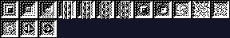
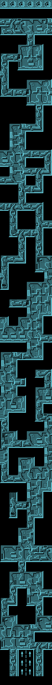
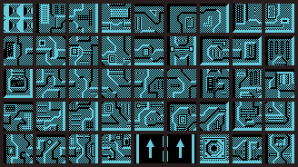
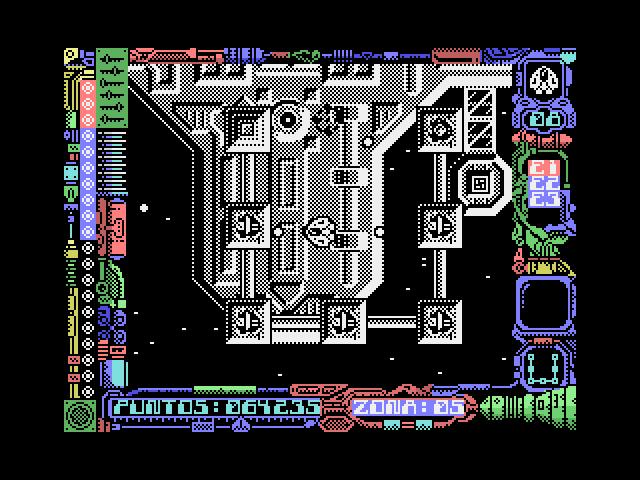
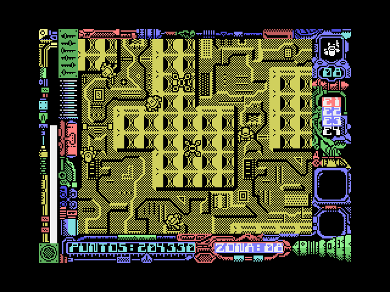

# The game

*Stardust* is a vertically scrolling shoot'em up. You fly a ship —the
Astrohunter— over the surface of a fleet of enemy supercruisers heading for
Earth, dodging or destroying whatever comes at you until you reach the shield
generators.

And then it changes game. On clearing the last ship zone the character **lands
and carries on on foot**, and that is the final stage.

This page gathers the game as it looks and sounds: the graphics, the 7+1
levels with their maps, the texts, the music, and two shots of the game
running. The how and the why of each thing is in [Findings](FINDINGS.html).

## The graphics, taken out of the tape

None of what follows is a screenshot: it is all drawn from the bytes of the
binary, using the geometry the game itself uses. That is what makes it a check
rather than an illustration — if the block's layout were wrong, noise would come
out.

### The logo


It is the first thing in the game block: its first 256 bytes, a 128×16 bitmap
at 16 bytes per row. It is the same sign the attract mode animates bouncing
over the play area, and the one heading this site's front page.

### The 111 scenery tiles


They run from 0x6DE0 to 0xA55F and are **32×32 pixels**, four bytes per line,
128 bytes each. The arithmetic closes on its own: 111 × 128 = 14,208, and
0x6DE0 + 14,208 = 0xA560, which is exactly where the sprites begin.

### The 83 sprites


From 0xA560 to 0xBA1F, **16×16 pixels with a mask**: each line carries the bits
of the drawing and the bits of the mask that says which pixels belong to it.
That is 64 bytes per sprite. The mask is not a flourish — it is what the
Spectrum's software drawing needs, opening a hole with AND before painting with
OR.

### The charset and the sentinels


59 characters of 8×8 at 0x6000. And the fifteen 24×24 sentinel nodes, at
0x69A8:



## The eight levels: seven zones and a tower

The game is 7+1 levels: seven zones you fly over piloting the ship, and an
eighth —the scoreboard itself numbers it ZONA:08— that is climbed on foot.

### The seven ship zones

Each zone takes about **250 bytes** on the tape, nowhere near enough for a map.
They are **compressed**, and the scheme is a pretty one: a *recursive* phrase
dictionary. Every byte of the stream is a token; with bit 7 clear it is a tile
number that goes straight into the map, and with bit 7 set the low seven bits
index a phrase in the dictionary. That phrase is expanded by calling the same
routine, so **a phrase can contain other phrases**. It is a grammar, not a
copy-paste. An 0xFF ends the level.

Expanded, all seven zones come to **exactly 450 bytes**. Seven different streams
landing on the same size is the sign that the decompressor is reading it right.
And 450 = 6 × 75: the width isn't a choice, it follows from the screen buffer
being 24 characters wide and each tile being four. (This went out as 10 × 45,
from reading the buffer's axes backwards; with the right width the maps come out
symmetrical and with their structures whole.)

Every byte is a tile index, and they run from 0 to 110 when there are exactly
111 tiles. Zone 7 uses number 110, the last one. Another check that falls out on
its own.

Each zone's colour comes from the same table as its pointer, and the seven cycle
through three: red, white and cyan.


They are rebuilt with `tools/descomprime_nivel.py` and `tools/render_niveles.py`.

### Zone 8: the on-foot tower

The last zone isn't flown over: it is climbed. Its map sits at 0x840B —78 rows
of 6 cells— and is drawn with its own pool of 45 tiles of 32×32, so the whole
tower measures **192×2496 pixels**. Every byte of the map is two things at
once, the cell's drawing and its physics, and that story —with the camera, the
checkpoints and death by falling— is in
[Findings](FINDINGS.html#the-whole-tower-and-a-map-that-is-two-maps).


Below the starting point sits the arrow sign pointing up (tiles 0x28 and 0x29
appear nowhere else), and row 0 is a cornice of rosettes. The bare structure,
without the background pattern, and its tile pool:





They are rebuilt with `tools/render_torre.py`.

## The frame and the loading screen

The play screen carries a decorated frame on all four sides and leaves a central
window for the action, with the score and the zone number along the bottom. The
frame is very much of its time and very much of the Spectrum: it takes advantage
of the fact that the borders never change to fill them with detail at no cost.
It is not drawn piece by piece: **it ships ready-drawn inside the game block**,
which is why it can be composed straight from the tape:


How it inherits its name table from the loading screen —and why that lets the
scoreboard write drawings instead of letters— is told in
[Findings](FINDINGS.html#the-game-frame-travels-in-the-block-and-the-loading-screen-sets-the-table).


The loading screen isn't a capture either: it is drawn from the 12,288 bytes
its own block sends to video memory. It is signed **CANO**, bottom left.

## The game's text

Read out of the binary, exactly as it sits there:

- The menu: `JOYSTICK`, `TECLADO`, `REDEFINIR TECLAS`, `JUGAR` — joystick,
  keyboard, redefine keys, play.
- The high-score table ships from the factory with in-house names: `JAVIER
  100000`, `JUAN C 080000`, `MARTA 060000`, `MARIA 050000`, `TOPO 030000`,
  `SOFT 020000`.
- And the notice that the good part is coming, right before the second load:
  `HAS CONSEGUIDO PENETRAR LAS DEFENSAS DE LA NAVE INSIGNIA / PERO LO PEOR AUN
  NO HA LLEGADO` — you have broken through the flagship's defences, but the
  worst is yet to come.

And the credits, which are the most interesting thing in the whole text block,
because they answer the question underlying this disassembly: **who made the
MSX version**. The authors of the ZX Spectrum version warn in their own
repository that they did not make it, and here is the name, in the binary:

```
CONVERSION POR
CARLOS ARIAS
GRAFICOS
JUAN CARLOS Y JAVIER AREVALO
...ADEMAS DE...
JULIO MARTIN
MUSICA COMPUESTA POR
GOMINOLAS
BASADO  EN
UNA IDEA  ORIGINAL
JOSE MANUEL  MU&OZ
TOPO SOFT
```

"Conversion by Carlos Arias; graphics by Juan Carlos and Javier Arévalo; and
also Julio Martín; music composed by Gominolas; based on an original idea by
José Manuel Muñoz." The graphics are still the Arévalo brothers', the same as
the original version, which fits with the artwork having been carried across
as it was. The conversion of the code, on the other hand, is signed by Carlos
Arias. That `&` in `MU&OZ` is not a transcription slip: it is how the game's
charset encodes the letter ñ.

## The music, as the chip put it out

Stardust stores its music in a language of its own, fifteen commands strong,
and that story —the interpreter, the three voices, a score that doesn't hold a
single note— is in [Findings](FINDINGS.html#sound-is-a-language). Here is the
result, which is what 1987 got to hear.

These two pieces are **not synthesised from the listing: they are what the
sound chip put out**, captured register by register with the game running in
the emulator and turned back into sound. That is why their names say "medida"
—measured. The reading of the score was verified separately, frame by frame
against these same captures.

The ship game's music —the C–A–F–G progression, two bars per chord—:

<audio controls src="audio/musica_naves_medida.mp3"></audio>

And the on-foot stage's high-score table music:

<audio controls src="audio/musica_records_medida.mp3"></audio>

## And this is it running

Everything above is drawn from the tape. These two are the opposite: two frames
of the recorded playthrough that ships with the repository (`Stardust.omr`),
taken with openMSX at seconds 1002 and 2150 of the recording. A render proves
the data has been understood; a screenshot proves something else — that the
program starts and runs.





The second one doubles as proof of the multiload, which is why it is taken so
late: in that playthrough the player **clears zone 7**, the game goes back to
the tape —the motor comes on at second 1552.20— and what carries on running is
the other program. You don't have to take the scoreboard's word for it: dumping
memory from 0x61D0 to 0xD674 at that instant, **29,585 of its 29,861 bytes
(99.08%) are those of the tape's fourth block**, against 674 of the ship block
that was at those same addresses before. And the program counter sits at
0xA9BA, inside the second part.
