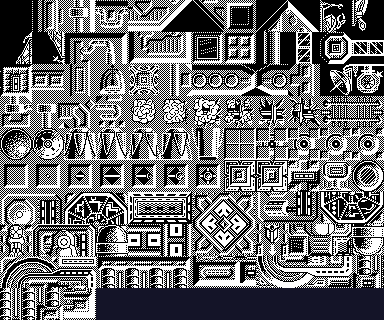
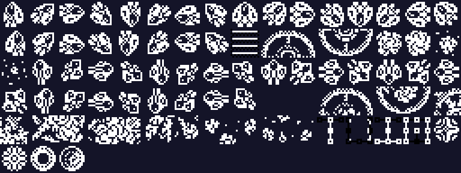
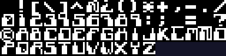
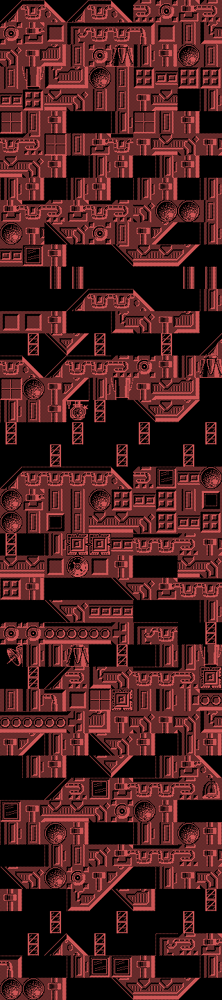
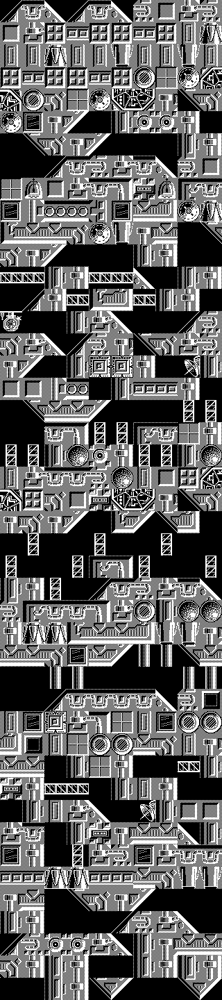
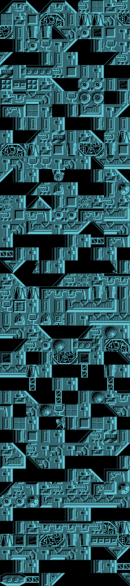
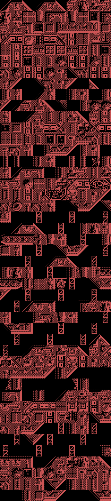
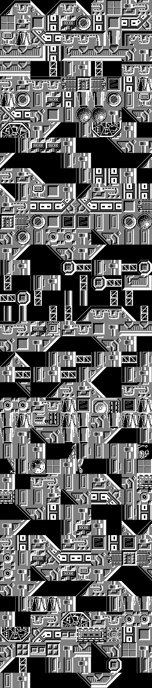
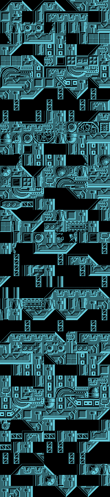
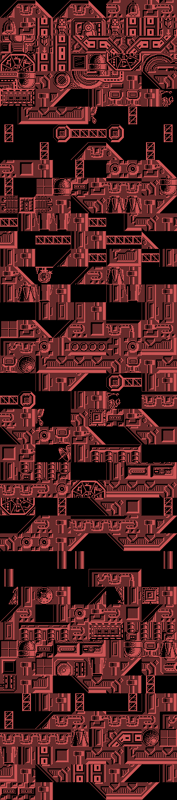

# El juego

*Stardust* es un matamarcianos de scroll vertical. Se pilota una nave —el
Astrohunter— sobre la superficie de una flota de supercruceros enemigos que va
camino de la Tierra, esquivando o destruyendo lo que sale al paso hasta llegar a
los generadores de escudo.

Y luego cambia de juego. Al superar la última zona de naves, el protagonista
**aterriza y sigue a pie**, y esa es la fase final.

## Los gráficos, sacados de la cinta

Nada de lo que hay aquí son capturas: todo está dibujado a partir de los bytes
del binario, con la geometría que usa el propio juego. Eso es lo que lo
convierte en una comprobación y no en una ilustración: si el reparto del bloque
estuviera mal, saldría ruido.

### Los 111 tiles del decorado



Ocupan de 0x6DE0 a 0xA55F y son de **32×32 píxeles**, cuatro bytes por línea,
128 bytes cada uno. La cuenta cierra sola: 111 × 128 = 14 208, y 0x6DE0 + 14 208
= 0xA560, que es justo donde empiezan los sprites.

### Los 83 sprites



De 0xA560 a 0xBA1F, **16×16 píxeles con máscara**: cada línea trae los bits del
dibujo y los de la máscara que dice qué píxeles son suyos. Son 64 bytes por
sprite. Esa máscara no es un capricho: es lo que necesita el dibujado por
software del Spectrum, que abre hueco con AND antes de pintar con OR.

### La tipografía y los centinelas



59 caracteres de 8×8 en 0x6000, y los quince nodos centinela de 24×24 en 0x69A8.

## Los mapas de las siete zonas

Cada zona ocupa unos **250 bytes** en la cinta, que no da ni de lejos para un
mapa. Van **comprimidos**, y el esquema es bonito: un diccionario de frases
*recursivo*. Cada byte del flujo es un token; si tiene el bit 7 a cero es un
número de tile que va directo al mapa, y si lo tiene a uno los siete bits bajos
indexan una frase del diccionario. Esa frase se expande llamando a la misma
rutina, así que **una frase puede contener otras**. Es una gramática, no un
copia-pega. Un 0xFF acaba el nivel.

Al expandirlos, las siete zonas dan **exactamente 450 bytes**. Que siete flujos
distintos caigan en el mismo tamaño es la señal de que el descompresor lee bien.
Y 450 = 10 × 45: el ancho no se elige, sale de que el buffer de pantalla tiene
40 columnas y cada tile mide cuatro caracteres.

Cada byte es un índice de tile, y van de 0 a 110 cuando hay exactamente 111
tiles. La zona 7 usa el 110, el último. Otra comprobación que sale sola.

El color de cada zona viene de la misma tabla que el puntero, y las siete ciclan
entre tres: rojo, blanco y cian.









Se rehacen con `tools/descomprime_nivel.py` y `tools/render_niveles.py`.

## El marcador y las zonas

La pantalla de juego lleva un marco de adornos por los cuatro lados y deja una
ventana central para la acción, con la puntuación y el número de zona abajo. El
marco es muy de la época y muy de Spectrum: aprovecha que los bordes no cambian
para llenarlos de detalle sin coste.

## Los textos del juego

Leídos del binario, tal cual están:

- El menú: `JOYSTICK`, `TECLADO`, `REDEFINIR TECLAS`, `JUGAR`.
- La tabla de récords viene de fábrica con nombres de la casa: `JAVIER 100000`,
  `JUAN C 080000`, `MARTA 060000`, `MARIA 050000`, `TOPO 030000`, `SOFT 020000`.
- Y los créditos, que son lo más interesante de todo el bloque de texto,
  porque contestan la pregunta de fondo de este desensamblado: **quién hizo la
  versión de MSX**. Los autores de la versión de ZX Spectrum avisan en su propio
  repositorio de que ellos no la hicieron, y aquí está el nombre, en el binario:

  ```
  CONVERSION POR
  CARLOS ARIAS
  GRAFICOS
  JUAN CARLOS Y JAVIER AREVALO
  ...ADEMAS DE...
  JULIO MARTIN
  MUSICA COMPUESTA POR
  GOMINOLAS
  BASADO  EN
  UNA IDEA  ORIGINAL
  JOSE MANUEL  MU&OZ
  TOPO SOFT
  ```

  Los gráficos siguen siendo de los hermanos Arévalo, los mismos de la versión
  original, lo que encaja con que el dibujo se trajera tal cual. La conversión
  del código, en cambio, la firma Carlos Arias. Ese `&` de `MU&OZ` no es una
  errata de la transcripción: es cómo la tipografía del juego codifica la eñe.
- Y el aviso de que viene lo bueno, justo antes de la segunda carga:
  `HAS CONSEGUIDO PENETRAR LAS DEFENSAS DE LA NAVE INSIGNIA / PERO LO PEOR AUN
  NO HA LLEGADO`.
