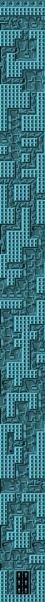
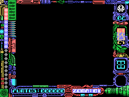
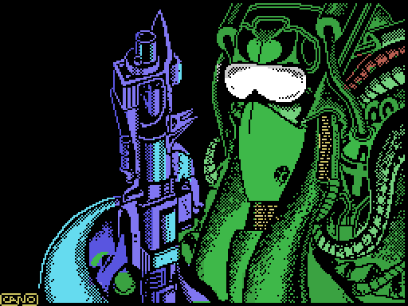

# Hallazgos

Stardust es una conversión del ZX Spectrum, y eso se sabía. Lo que no se
esperaba al abrir la cinta es **hasta dónde llega la conversión**: no se
trajeron los gráficos y rehicieron lo demás, se trajeron el sistema de
grabación, la rutina de carga y la forma de dibujar. Lo que sigue es lo que
apareció al desmontarla, cada cosa con la prueba que la sostiene.

## La cinta no es una cinta de MSX

Un juego de MSX se graba en bloques **KCS**, que es el formato del sistema: lo
escribe la propia BIOS y lo lee la propia BIOS. Los otros títulos de Topo Soft
para esta máquina lo hacen así.

Stardust, no. Sus cuatro bloques de datos son **bloques del ZX Spectrum**, con
la estructura de allí: un byte de bandera, los datos, y un byte final que es el
XOR de todo lo anterior. Los cuatro traen ese checksum correcto, comprobado uno
por uno; es la única verificación de integridad que lleva la cinta.

Y el cargador es una **reimplementación de LD-BYTES**, la rutina de carga de la
ROM del Spectrum, con su mismo interfaz de registros:

    ld ix,047a0h    ; IX = donde va
    ld de,0b647h    ; DE = cuantos bytes
    ld a,000h       ; A  = la bandera que se espera
    scf             ; carry activado = cargar, no verificar
    call 0405ch

Quien haya programado un Spectrum reconoce esa llamada: es la de `0x0556` de su
ROM, parámetro por parámetro.

## Los 64K que el Spectrum tiene y el MSX no

Antes de cargar nada, el cargador hace algo que en un juego de MSX normal no
haría falta: **busca RAM y la mapea en las páginas 1 y 2**.

    ld hl,04000h / call sub_d30fh
    ld hl,08000h / call sub_d30fh

La rutina de `0xD30F` prueba a escribir en cada ranura con `ENASLT` (la llamada
`0x0024` de la BIOS) hasta encontrar RAM. El motivo es que el Spectrum tiene 48K
planos de RAM y el MSX no: en el MSX, la mitad baja de la memoria la ocupa la
ROM del BASIC. Para que el juego portado encuentre la memoria donde la espera,
hay que quitar la ROM de en medio.

## El cargador trae una puerta trasera para trainers

Esta es la mejor. El cargador, antes de arrancar el juego, copia **94 bytes**
desde 0xDAC0 a 0xFDE8 —memoria alta, donde nada los va a machacar— y luego mira
qué hay en ellos:

    4040: ld hl,0fde8h / ld b,003h
    4045: ld a,(hl) / cp 0c9h / jp nz,0bd85h   ; ¿tres 0xC9 de firma?
    404e: ld b,(hl)                            ; B = cuantos parches
    4050: ld e,(hl) / ld d,(hl) / ld a,(hl)    ; direccion y valor
    4056: ld (de),a / djnz 4050                ; aplicarlos
    4059: jp 0bd85h                            ; y ahora si, al juego

Si esos 94 bytes empiezan por tres `0xC9`, el cargador los trata como una lista
de parches y los aplica sobre el juego recién cargado. Es **un aplicador de
POKEs de fábrica**, metido en el cargador comercial del juego.

Y la cuenta dice para cuántos: 3 bytes de firma + 1 de contador + **30 parches
de 3 bytes cada uno = 94**. Está dimensionado exactamente para treinta.

Eso explica por qué los cargadores de las revistas de la época funcionaban tan
bien con este juego. El de *Input MSX* número 19 escribe con
`FOR I=56000 TO 56012`, y 56000 es 0xDAC0: el buzón. Sus tres parches, leídos
del binario antes de aplicarlos:

    0xC06E/6F:  38 1F (jr c,+31)  ->  18 EC (jr -20)
    0xF7B1:     01 -> 00

El primero convierte un salto condicional en incondicional, saltándose una
comprobación que va justo detrás de `ld a,(0c188h) / cp 004h`. El segundo cambia
el `1` de un `ld a,001h` por un `0`. Aplicados por el propio cargador del juego,
la nave aguantó dieciséis minutos seguidos sin morir.

## Cómo pide el juego la segunda parte

Al superar la última zona de naves sale una pantalla que dice

    FELICIDADES
    HAS CONSEGUIDO PENETRAR LAS DEFENSAS DE LA NAVE INSIGNIA
    PERO LO PEOR AUN NO HA LLEGADO

y el juego vuelve a la cinta a por la segunda parte, la de a pie.

Lo interesante es **cómo** lo hace. La rutina de carga del cargador sobrevive
toda la partida en la página 1 —el juego se carga a partir de 0x47A0 y no la
pisa— así que lo lógico sería que la llamara. Pues no: un punto de observación
sobre ella no saltó **ni una vez en 4000 segundos de juego**. El juego trae la
suya:

    f7f6: ld hl,0f89fh / push hl    ; empuja a mano la direccion de vuelta
    f7fb: ld a,008h / out (0abh),a  ; enciende el MOTOR de la cinta
    f7ff: ld a,00eh / out (0a0h),a  ; registro 14 del PSG, el del bit de cinta

Tampoco es una copia de la otra: se buscó su firma byte a byte en los tres
bloques y no aparece en ninguno.

Se caza poniendo un punto de observación no sobre una rutina, sino sobre el
**destino**: cualquier escritura en 0x61D0, que es donde el descriptor dice que
va la segunda parte. Salta con el contador de programa en 0xF849. Y lo que
queda ahí después coincide con el bloque de la cinta salvo 180 bytes de 29861
—el 99,4 %—, que son las variables que la segunda parte ya había tocado cuando
se miró.

## Dos motores distintos en una cinta

Las dos partes del juego no comparten motor, y se ve en cómo llevan a sus
criaturas. En la parte de naves cada entidad apunta en su estructura de 8 bytes
la rutina que la gobierna, y el juego salta ahí con un `jp (hl)`: capturando
esos saltos con el juego en marcha, los IX van de 8 en 8 (0xCB3A, 0xCB42 ·
0xC8D8, 0xC8E0…).

La parte de a pie no trata así a sus enemigos: viven en **tablas de 5 bytes por
objeto** —los andantes en 0xACE4, cuatro como máximo; los voladores en 0xACF9;
los dos tiros de la torreta en 0xAD04— y no llevan rutina apuntada, los mueven
bucles fijos, uno por especie. (Aquí estuvo publicado "los IX van de 46 en 46:
entidades casi seis veces mayores", por tomar por enemigos lo que despacha el
`jp (hl)` de 0xC544. La medida era buena y la lectura no: esos IX —0xD068,
0xD096, 0xD0C4, tres huecos consecutivos de 46 bytes justos— son de **otra**
estructura, la zona de variables de 0xD068-0xD117 que llega de la cinta a cero.
Qué subsistema es sigue abierto.)

Lo que sí comparten es el oficio de dibujar. Comparando 40 bytes de la rutina de
sprites de una parte con la de la otra, **solo difieren seis**, y tres de ellos
son `and (hl)` contra `or (hl)`. Es la técnica del Spectrum, que no tiene
sprites por hardware: se desplaza el dibujo bit a bit con una tira desenrollada
de `adc hl,hl`, se abre hueco con AND y se pinta con OR.

## Lo que el MSX obligó a cambiar

Hay una diferencia de fondo entre las dos máquinas que la conversión no pudo
esquivar. El Spectrum escribe **directamente** en su memoria de pantalla, que es
RAM normal en 0x4000. En el MSX la memoria de vídeo está detrás del chip gráfico
y no se puede direccionar: hay que enviarla byte a byte por un puerto.

Por eso esta versión lleva algo que el original no necesita: un **buffer de
pantalla** en RAM, y una rutina que lo vuelca. El buffer va de **0x4000 a
0x4EFF: 3.840 bytes, 24 de ancho por 160 de alto**, y el volcado lo pasa a la
VRAM en **tres bandas** —0x4000 con 56 filas, 0x4540 con 64 y 0x4B40 con 40—,
una por cada llamada de la rutina, cada una a su tercio del SCREEN 2. Lo dice
el código (las tres llamadas de 0xF3DC, contiguas y cerrando al byte) y lo
confirma el emulador, donde esa rutina hizo **3.252.480 escrituras** con el
puntero recorriendo exactamente 0x4000-0x4EFF.

**Los ejes estuvieron publicados al revés**, y merece contarse porque el error
se propagó. El `ld b,028h` del volcado se leyó como «40 columnas», pero es el
bucle interior y recorre el buffer a saltos de 24: recoge 40 bytes de una misma
columna. Quien cuenta columnas es el exterior, `ld c,018h`, que avanza de uno en
uno 24 veces.

Lo caza dibujarlo: de 24 en 24 sale la tabla de récords legible; de 40 en 40,
ruido. Y encaja con lo que se ve jugando, que es de donde salió la duda: 24
bytes son 192 píxeles, más estrecho que la pantalla —por eso el marco de los
lados no se mueve—, y lo que sobra está a lo alto, que es por donde scrollea.

## La fase de a pie tiene su propia demo, y su propia partida grabada

La demo de la parte de naves no es una máquina jugando: son **869 bytes de
partida grabada**, un byte por fotograma. La fase de a pie tiene la suya, y no
podría ser de otro modo: la grabación de las naves está en 0xBA20 y su lector en
0xC1AF, y **las dos direcciones caen dentro de 0x61D0-0xD674**, o sea que la
segunda parte las machaca al cargarse.

La suya empieza en **0x9FF3** y son **646 bytes**, que a 50 Hz son 12,9 segundos.
El sitio lo dice el propio código —`ld hl,09ff3h` en 0xA3FF— y el corte se ve a
simple vista, porque justo antes hay dibujo:

```
9FE3  55 55 55 55 AA AA AA AA 55 55 55 55 AA AA AA AA   <- damero, dos valores
9FF3  00 00 00 00 00 00 00 00 ...                       <- ya no
```

Los 646 bytes usan 17 valores distintos, **todos pares y ninguno mayor de 0x1E**:
es la máscara de controles, un byte por fotograma.

Y lo interesante es **cómo se enciende**. En 0xA688 hay una llamada cuyo operando
se reescribe desde dos sitios:

```
a313: ld hl,0a6fch / ld (0a689h),hl   <- partida normal: lee los mandos
b6ca: ld hl,0a6eeh / ld (0a689h),hl   <- demo: lee la grabación
```

La misma llamada, dos orígenes, conmutados parcheando el código. Y el rótulo
DEMO que parpadea abajo a la derecha **no consulta ningún indicador**: le
pregunta a la instrucción parcheada.

```
a4d1: ld a,(0a689h)   ; el operando de esa llamada
a4d4: cp 0eeh         ; ¿apunta a 0xA6EE, el lector de la grabación?
a4d6: jr nz,...       ; si no, no estamos en demo
```

Esto apareció porque un jugador se pasó el juego y contó que, tras la tabla de
récords, arrancaba una demo **de la fase a pie**. El lector estaba dentro de un
rango que este proyecto tenía etiquetado como «tabla».

## Lo que decía aquí sobre la música, y por qué ya no

Aquí se afirmaba que las tablas de música se habían portado enteras, con 754
bytes idénticos a los de la versión de Spectrum en 0xAB0E. **Se retira.**

Esa coincidencia la daba la misma herramienta de cotejo cuya búsqueda resultó
estar mal, y 0xAB0E cae dentro del rango que este proyecto declara como sprites
(0xA560-0xBA20). O sea que el «hallazgo» consistía en encontrar dibujo donde se
buscaba código, que es exactamente el fallo que contaminó el trazado entero.

Que las dos partes del juego suenan parecido se puede seguir mirando —y hay una
rutina de sonido identificada en el binario de MSX—, pero la afirmación fuerte,
la de los 754 bytes, no se sostiene hasta rehacer el cotejo con una búsqueda que
exija coincidencia única.

## La misma letra, nítida o transparente

En la tabla de récords el texto sale con los píxeles separados, como si fuera
medio transparente, y en cambio el rótulo `DEMO` se ve totalmente nítido.
Parecen dos tipografías. Es la misma rutina, y la diferencia está hecha
**parcheando el código al vuelo**.

La rutina que dibuja un carácter lo hace a doble altura: cada línea de la fuente
se pinta dos veces, y cada copia va enmascarada con un patrón distinto.

```
d4d0: ld a,(de) / and 055h / or (hl) / ld (hl),a / add hl,bc
      ld a,(de) / and 0aah / or (hl) / ld (hl),a / add hl,bc
```

`0x55` y `0xAA` son `01010101` y `10101010`: píxeles alternos, y desplazados de
una línea a la siguiente. Sale un damero, que a la vista es un medio tono.

Y ahora lo bueno: esas dos máscaras **no son constantes**. Son los operandos de
esos dos `and`, en 0xD4D3 y 0xD4D9, y el juego los reescribe antes de dibujar:

```
bfb4: ld a,0ffh / ld (0d4d3h),a / ld (0d4d9h),a   ; máscara neutra
bfbc: ld ix,0ddf2h                                ; la cadena "DEMO"
bfc0: ld hl,04d94h / call 0d4e5h                  ; dibujar
bfc6: ld a,055h / ld (0d4d3h),a
bfcb: ld a,0aah / ld (0d4d9h),a                   ; y restaurar
```

Con `0xFF` el `and` no quita nada y salen todos los píxeles. Es código
automodificable usado como si fuera un parámetro.

De paso, la rutina confirma dónde está la fuente: indexa con `0x5F00 + código×8`,
y con el primer código 0x20 eso da 0x6000, que es justo donde están los 59
caracteres. Y el paso entre líneas de pantalla es 24, el alto del buffer por
columnas.

## Un solo plano, y por qué parece que hay dos

Quien lo jugó recuerda dos pisos moviéndose a velocidades distintas, con su
sensación de profundidad. Se buscó en serio: vigilando qué rutina escribe en
cada banda del buffer, y levantando cuadro a cuadro la tabla de «qué fila se
dibujó desde qué dirección», que permite medir el desplazamiento por igualdad
exacta de números en vez de comparando imágenes.

El resultado es rotundo: **el fondo es un solo plano**. En cuatro medidas —tres
momentos de la fase de a pie y uno de la de naves— las dieciocho tiras del
buffer (tres bandas por seis columnas) se desplazan **igual**: +2 filas por
cuadro andando, 0 paradas, −2 hacia atrás, con el 100 % de acierto y sin
desplazamiento horizontal.

La profundidad está en otro sitio: en el **orden de dibujo**. Numerando cada
escritura al buffer dentro del cuadro, en la fase de naves sale siempre la
misma secuencia: primero el fondo entero, después los sprites, y **después de
los sprites** una rutina más (0xC77A) que pinta columnas del decorado leyendo
de su propio almacén de tiles. Se le vio hacerlo en directo: un pilar bajando,
la nave subiendo hacia él, y al cruzarse los destinos el pilar quedó pintado
encima. La nave no pasa *por debajo del piso*: pasa **por detrás de lo que se
repinta después**.

Y en la fase de a pie el parallax **existe de verdad**, solo que no es un
plano: es un dibujo que se redibuja distinto. El fondo se pinta **dos veces
por cuadro parcheando un opcode**: el bucle de juego escribe `0xC2` (`jp nz`)
en 0xA98E y llama al redibujado —así solo se pintan las celdas vacías, que
llevan el tile 0— y después escribe `0xCA` (`jp z`) y vuelve a llamar, para
las sólidas. Y ese tile 0 está vivo: cada paso de scroll lo **rota una fila de
píxel** (0xB140 al subir, 0xB167 al bajar; la fila que sale entra por el otro
lado). Una fila de trama por cada dos de scroll: **el fondo de los huecos se
mueve a mitad de velocidad que las plataformas**. Por eso las tiras del buffer
se desplazan todas igual —lo del párrafo de arriba sigue siendo cierto— y aun
así el ojo ve dos velocidades. Medido sobre la partida entera: 4712 pases con
cada opcode, ni un cuadro con otro valor.

## La torre entera, y un mapa que es dos mapas

La zona de la fase de a pie es una torre, y su mapa está en 0x840B: **78 filas
de 6 celdas**, 468 bytes, 280 celdas con suelo. Lo delata `base_mapa` (0xA9F5),
que hace `ld ix,0840bh` y devuelve la base más fila por seis. Es la única
referencia a ese rango en todo el listado, y por ella pasan los dos únicos
lectores.

Y esos dos lectores hacen del byte de celda **dos cosas a la vez**. Para el
redibujado, un **índice de tile**: origen = 0x87F3 + valor×128, así que la
celda dice con qué dibujo se pinta. Para la física, un **booleano**:
`consulta_mapa` (0xB18E) termina en `and a` y sus seis llamadores miran solo el
flag Z —celda cero es vacío—, ninguno usa el valor. No hay un mapa de colisión
y otro de decorado: hay uno solo con dos lecturas.

Las cuentas cierran al byte. El valor más alto del mapa es 44, y 0x87F3 +
45×128 − 1 = **0x9E72, exactamente el último byte** que se había visto leer al
blitter midiendo el puerto de vídeo: el pozo son 45 tiles justos.

Los tiles son de **32×32 píxeles** (128 bytes: 4 por fila, 32 filas), y eso
corrige un dato publicado: aquí decía que las celdas eran de 32×16 y la torre
de 1248 píxeles de alto. El alto de celda estaba **derivado, no medido** —otra
cifra heredada, como la de los ejes del buffer— y lo desmienten tres caminos
independientes: el tile de 128 bytes, la división entre 32 de `consulta_mapa`,
y el scroll fino, que da dieciséis pasos de 2 píxeles entre fila y fila. La
torre es de **192×2496 píxeles**, el doble de alta de lo publicado.

Con el mapa y el pozo, la torre se dibuja entera:



Abajo del punto de salida está el **cartel de flechas** que señala hacia
arriba (los tiles 0x28 y 0x29, que solo aparecen ahí), y la fila 0 es una
cornisa de rosetas (el tile 0x2A). La estructura sola, sin la trama de fondo,
está en [torre_estructura.png](../imagenes/torre_estructura.png), y el pozo de
45 tiles en [tiles_apie.png](../imagenes/tiles_apie.png).

La cámara que recorre la torre es el par (0xAD2A, 0xAD2C): fila del mapa más
desplazamiento fino en píxeles. El actualizador (0xA8DB) mueve el fino de 2 en
2 hasta 32 y entonces cambia de fila, con topes en la 0 y la 71; el engranaje
se vio en directo en el emulador: la sonda registró `(fila 57, fino 32)` y al
paso siguiente `(fila 56, fino 2)`. Cada paso sobre suelo firme guarda además
un **checkpoint** (posición en 0xA6E9, cámara en 0xC466/67), que es adonde te
devuelve la muerte.

## La muerte del jugador estaba en otra parte

El jugador muere al pisar el vacío, y la rutina que parecía explicarlo —una
variante «fina» de la consulta del mapa, con lógica de sub-celda— resultó **no
ser suya**. Esa variante (0xB1BE) responde si una posición cae *bien centrada*
dentro de una celda vacía, y la usan solo los **enemigos voladores** para
decidir en qué hueco del muro anidar. Se midió sobre la partida entera: 2934
pasadas por ella, y el retorno apilado fue **siempre el mismo llamador**, el
bucle de los voladores. Ni una vez el jugador.

El jugador no está en ninguna tabla de objetos: vive en dos bytes (0xA6EB, con
la Y clavada en 0x68: subir y bajar no le mueve a él, mueve el mundo) y tiene
**su propia llamada** a `consulta_mapa`, en 0xA665, con la celda bajo los
pies. Si la celda es vacía:

```
a665: call consulta_mapa
a668: jr nz,<sigue andando>
a66a: ld a,004h / ld (0a6edh),a     ; estado 4: sentenciado
```

Y ya no hay vuelta: en toda la agonía (estados 4 a 45) no vuelve a consultarse
el mapa. **No existe el aterrizaje**: se muere en el instante de pisar el
vacío, y la caída que se ve es la animación del derrumbe, con sus frames
rotados según hacia dónde tropezó.

La otra muerte es por contacto. El **escudo** (0xA6ED, de 3 a 1, los tres
iconos del marcador) se descuenta al ser alcanzado, y a cero el juego parchea
el puntero de actualización del jugador para sustituirlo por un **cadáver en
parábola** (0xB268): sube, cae acelerando y —como tampoco consulta el mapa—
**atraviesa el suelo** y sale por abajo de la pantalla.

Las dos vías desembocan en el mismo embudo: cuando el estado llega a 45, se
resta una vida (0xC45F: tres al empezar, se ganan por puntos hasta nueve), y
con el contador agotado, game over; si quedan, el **respawn** te devuelve a la
última posición pisada en firme con la cámara del checkpoint, el escudo a
tres y las tablas de enemigos vaciadas.

Sobre la partida grabada salió el retrato completo: **veinte muertes, 19 por
contacto y una sola por caída**, las veinte pasando por el mismo descuento y el
mismo respawn. Y un detalle que explica que la partida acabara bien: el
contador de vidas antes de cada descuento fue subiendo de 2 a 6 a lo largo de
la partida. El jugador ganaba vidas más deprisa de lo que las perdía.

## La cuenta atrás es una torre que crece

Al final de la fase de a pie hay que destruir seis objetivos, y al caer el
sexto arranca una cuenta atrás. No son dígitos: es una **torre blanca que gana
una fila de píxeles cada ~2 segundos**. El mecanismo está entero en el listado:
el arranque del nivel deja un 6 en 0xBC33, cada objetivo destruido lo resta, y
con el contador a cero cada tic pinta una fila (`ld a,07eh / out (098h),a`) y
suma una a 0xBC30. El ritmo lo da el contador de cuadros global: un tic cada
dieciséis.

```
bbb4: cp 0a1h / jp z,0bceeh    ; a las 161 filas, se acabó
```

Y como en la partida grabada el jugador escapó, lo del final se comprobó **
dejando que se agotara**: se cargó la partida con la torre a medias, se
desconectó el mando, y a las 161 filas exactas saltó 0xBCEE: la secuencia de
destrucción, y de ahí directo a la tabla de récords. Game over, sin
FELICIDADES. Las cuentas de la partida real salen finas: escapó con unos **30
segundos de margen** de los 5,8 minutos que da el juego.

## Las explosiones llevan un fósil del Spectrum dentro

Las dos fases tienen explosión de partículas, cada una con su copia del código.
La de naves —cuando derriban al protagonista— siembra **64 partículas** en la
posición de la nave y las mueve **con gravedad**: la velocidad vertical crece
un punto por cuadro, y cada partícula es un píxel suelto dibujado sobre el
buffer. La del final feliz —la nave insignia vista desde fuera— son **200
partículas de metralla** sesgadas hacia arriba, sin gravedad.

Y en las dos, dentro del bucle que pinta cada partícula, está esto:

```
c663: and 018h / out (0feh),a
```

**0xFE es el puerto del borde del ZX Spectrum.** En el original, cada partícula
hacía parpadear el borde de la pantalla; en el MSX ese puerto no hace nada, y
ahí sigue la instrucción, ejecutándose en balde en cada partícula desde 1987.
Las dos copias del efecto la arrastran: la prueba más limpia que ha dado el
proyecto de que estas rutinas se trajeron del original tal cual.

De paso: el azar de las partículas —y del campo de 48 estrellas del fondo de
naves, que son alturas aleatorias pintadas con el patrón fijo `0x18`— sale de
un generador que **lee la ROM del BIOS como tabla de entropía**. Y el POKE de
inmortalidad de la revista Input MSX (el que parchea 0xC06E) actúa justo en el
despachador que decide si la nave está viva o explotando: la inmortalidad es,
literalmente, no dejar que se llame nunca al sistema de partículas.

## Por qué la segunda parte carga justo en 0x61D0

La dirección de carga del bloque de la fase de a pie parecía arbitraria hasta
que salió la fuente. Los dos rotuladores de esa fase —el del rótulo DEMO y el
menú, que pinta a doble altura con el damero, y el del marco, que escribe
directo a la memoria de vídeo— usan la misma fuente ASCII, indexada como
`0x5F00 + código×8`. La fuente la deja cargada el bloque de naves, y la fase de
a pie la reutiliza.

La cuenta cierra sola: el último carácter que la fuente necesita es la `Y`
(código 89), y 0x5F00 + 90×8 = **0x61D0 exacto**. El bloque de la segunda parte
carga en el primer byte libre después del glifo de la `Y`: ni un byte antes,
para no comerse la fuente heredada.

## Un intérprete de guiones

Dentro del juego de naves hay una máquina virtual pequeña. Los guiones que
gobiernan a los enemigos son bytes, y los que valen 0x80 o más son **opcodes**:

    e230: ld a,(bc) / cp 080h / jp c,0e231h   ; por debajo de 0x80 no es opcode
          sub 080h / ld hl,0e7a3h / call 0e5c0h / jp (hl)

y `0xE5C0` es exactamente «HL = tabla + A×2, HL = (HL)». La tabla de 0xE7A3
tiene **35 entradas**, y que son 35 y no más no es una estimación: la tabla
acaba en 0xE7E8 y el código del opcode 0x90 empieza pegado, en 0xE7E9.

## El marco del juego viaja en el bloque, y la pantalla de carga le deja la mesa puesta

El cuadro decorado que rodea el área de juego —con su HUD: la roseta con la
nave, los medidores de colores, la barra de PUNTOS y ZONA— no se dibuja pieza
a pieza: **viene dibujado de fábrica dentro del bloque del juego**. Sus
primeros 1415 bytes son el logo STARDUST (un bitmap de 128×16 que el modo
atracción anima en el área central) y, detrás, los patrones y los colores del
marco, 0x900 bytes de cada, que una rutina del arranque copia a la memoria de
vídeo.

La copia tiene una forma rara —dos filas de carácter por tercio de pantalla y
cuarenta y ocho tiras sueltas— que solo cobra sentido con la otra mitad del
truco: el juego **no construye la tabla de nombres** del SCREEN 2. **La hereda
de la pantalla de carga**, que la había rellenado «sumando ocho»: el carácter
n de cada tercio se ve en la columna n÷8, fila n mod 8. La carga de la cinta
machaca en RAM el programa de la pantalla de carga, pero la memoria de vídeo
sobrevive, y el juego cuenta con ello. Con ese mapeo heredado, el reparto raro
es, sencillamente, **la forma del marco**: los caracteres 0 a 31 y 224 a 255
de cada tercio son las cuatro columnas de cada lado, y las tiras, la fila de
arriba y la barra de abajo.

Las dos mitades están contrastadas con el emulador: la tabla de nombres real
del juego en marcha coincide **768 de 768** con el patrón heredado, y los
patrones y colores de la cinta aparecen idénticos en el **97,4 %** —el resto
es lo que el juego pinta encima: el campo de estrellas, los marcadores vivos—.
Y la prueba que vale por todas es dibujarlo desde la cinta con ese mapeo:



## La pantalla de carga



No es una captura: está dibujada a partir de los 12.288 bytes que el propio
bloque vuelca —6144 de patrón a la memoria de vídeo 0x0000 y 6144 de color a
0x2000—, siguiendo lo que hace su rutina de 0x9C10.

Tiene truco, y de los que enseñan algo. La tabla que dice qué dibujo va en cada
casilla no se rellena en orden 0, 1, 2, 3… sino **sumando ocho**: 0, 8, 16 …
248, 1, 9, 17 … Son los mismos 256 valores por tercio de pantalla, pero
intercalados. Dibujarla suponiendo orden secuencial da ruido convincente, que es
el peor tipo de error: parece que el reparto del bloque está mal cuando lo que
está mal es cómo lo lees.

Va firmada **CANO**, abajo a la izquierda.
